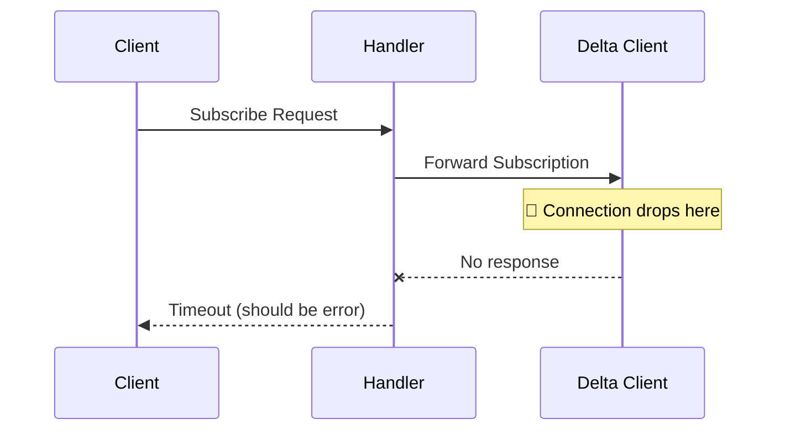

# Documentation Standards

These rules ensure consistent, comprehensive documentation throughout the WebSocket service project.

## General Documentation Principles

### Write documentation for your future self
- Assume the reader has no context about the code
- Explain the "why" not just the "what"
- Include examples wherever possible
- Keep documentation up-to-date with code changes

### Use consistent formatting
- Follow markdown conventions
- Use consistent heading hierarchy
- Include table of contents for long documents
- Use code blocks with appropriate syntax highlighting

## Code Documentation

### Function and method documentation
```go
// ✅ Good: Comprehensive function documentation
// HandleWebsocket manages the lifecycle of a WebSocket connection including
// the initial upgrade, message processing, and cleanup. It handles client
// subscriptions to various channels and broadcasts messages accordingly.
//
// The function performs the following steps:
// 1. Upgrades HTTP connection to WebSocket
// 2. Registers client for message broadcasting
// 3. Starts message processing goroutines
// 4. Handles connection cleanup on exit
//
// Parameters:
//   - w: HTTP ResponseWriter for the upgrade
//   - r: HTTP Request containing upgrade headers
//
// Returns an error if the WebSocket upgrade fails or if critical
// message processing errors occur.
func (h *WebsocketHandler) HandleWebsocket(w http.ResponseWriter, r *http.Request) error {
    // Implementation...
}
```

### Struct documentation
```go
// ✅ Good: Clear struct purpose and field descriptions
// WebsocketHandler manages client WebSocket connections and message broadcasting.
// It maintains active connections, handles subscriptions, and coordinates
// message delivery from external sources to connected clients.
//
// The handler is thread-safe and can handle multiple concurrent connections.
// It automatically cleans up resources when connections are closed.
type WebsocketHandler struct {
    // connections stores active WebSocket connections indexed by client ID
    connections map[string]*Connection
    
    // mu protects concurrent access to the connections map
    mu sync.RWMutex
    
    // deltaClient handles communication with Delta Exchange WebSocket API
    deltaClient *DeltaWebsocketClient
    
    // config contains handler configuration including timeouts and limits
    config *Config
}
```

### Package documentation
```go
// ✅ Good: Package-level documentation
// Package handlers provides WebSocket connection management and message
// processing functionality for the Cryptovate WebSocket service.
//
// The main component is WebsocketHandler which manages the lifecycle of
// client connections, handles subscription requests, and coordinates
// message broadcasting from external data sources.
//
// Key features:
//   - Concurrent connection handling
//   - Channel-based message broadcasting
//   - Automatic connection cleanup
//   - Integration with Delta Exchange API
//
// Example usage:
//   handler := handlers.NewWebsocketHandler(ctx, config)
//   defer handler.Close()
//   
//   http.HandleFunc("/ws", handler.HandleWebsocket)
//   log.Fatal(http.ListenAndServe(":8080", nil))
package handlers
```

## API Documentation

### REST Endpoint Documentation
```markdown
## WebSocket API

### Connect to WebSocket
**Endpoint**: `GET /ws`  
**Protocol**: WebSocket  
**Authentication**: Optional (via `Sec-WebSocket-Protocol` header)

Establishes a WebSocket connection for real-time data streaming.

**Request Headers**:
```http
GET /ws HTTP/1.1
Host: api.example.com
Upgrade: websocket
Connection: Upgrade
Sec-WebSocket-Key: dGhlIHNhbXBsZSBub25jZQ==
Sec-WebSocket-Version: 13
Sec-WebSocket-Protocol: auth-token-here
```

**Response**: HTTP 101 Switching Protocols

**Error Responses**:
- `400 Bad Request`: Invalid WebSocket upgrade request
- `401 Unauthorized`: Missing or invalid authentication
- `429 Too Many Requests`: Connection limit exceeded
```

### Message Format Documentation
```markdown
### Subscribe to Channel

**Message Type**: `subscribe`

Subscribe to receive real-time updates for a specific channel.

**Request Format**:
```json
{
  "type": "subscribe",
  "channel": "v2/ticker",
  "product_ids": [27, 28, 29]
}
```

**Fields**:
- `type` (string, required): Must be "subscribe"
- `channel` (string, required): Channel name to subscribe to
- `product_ids` (array of integers, optional): Filter by specific product IDs

**Response Format**:
```json
{
  "type": "subscribed",
  "channel": "v2/ticker",
  "message": "Successfully subscribed to v2/ticker"
}
```

**Error Response**:
```json
{
  "type": "error",
  "message": "Invalid channel name",
  "code": "INVALID_CHANNEL"
}
```
```

## Bug Report Documentation

### Bug Report Requirements
Every bug report must include:

1. **Clear title** - Descriptive and specific
2. **Severity classification** - Critical, High, Medium, Low
3. **Reproduction steps** - Exact commands and expected vs actual results
4. **File locations** - Specific files and line numbers
5. **Flow diagram** - Visual representation of where the bug occurs
6. **Solution approaches** - Multiple approaches with pros/cons
7. **Verification steps** - How to confirm the fix works

### Bug Report Title Format
```markdown
# [Component] [Issue Type] - [Brief Description] - [Severity]

Examples:
# WebSocket Handler Connection Leak - Critical
# Delta Client Missing Error Handling - High  
# Configuration Validation Edge Case - Medium
# Log Message Formatting Issue - Low
```

### Flow Diagram Standards
Use Mermaid diagrams to show:
- Where in the process flow the bug occurs
- Expected vs actual behavior
- Component interactions
- Data flow issues



## Configuration Documentation

### Configuration File Documentation
```yaml
# WebSocket Service Configuration
# This file contains environment-specific settings for the WebSocket service

# Server Configuration
http_port: 8080        # Port for HTTP/WebSocket server
grpc_port: 9090        # Port for gRPC server
read_timeout: 30s      # Maximum time to wait for client message
write_timeout: 30s     # Maximum time to wait for message send

# Delta Exchange Integration
delta:
  websocket_url: "wss://api.delta.exchange/v2/ws"  # Delta WebSocket endpoint
  auth_token: "${DELTA_AUTH_TOKEN}"                # Authentication token (env var)
  reconnect_delay: 5s                              # Delay between reconnection attempts
  max_retries: 10                                  # Maximum reconnection attempts

# Feature Flags
features:
  metrics_enabled: true          # Enable metrics collection
  auth_required: false           # Require client authentication
  rate_limiting_enabled: false   # Enable rate limiting
```

### Environment Variable Documentation
```markdown
## Environment Variables

| Variable | Required | Default | Description |
|----------|----------|---------|-------------|
| `HTTP_PORT` | No | 8080 | Port for HTTP/WebSocket server |
| `GRPC_PORT` | No | 9090 | Port for gRPC server |
| `DELTA_AUTH_TOKEN` | Yes | - | Delta Exchange API authentication token |
| `LOG_LEVEL` | No | info | Logging level (debug, info, warn, error) |
| `METRICS_ENDPOINT` | No | /metrics | Endpoint for metrics collection |

### Examples

**Development**:
```bash
export DELTA_AUTH_TOKEN="your-dev-token"
export LOG_LEVEL="debug"
make run
```

**Production**:
```bash
export DELTA_AUTH_TOKEN="your-prod-token"
export HTTP_PORT="80"
export LOG_LEVEL="warn"
./websocket-service
```
```

## README Standards

### Required README Sections
1. **Project Description** - What the project does
2. **Quick Start** - Minimal steps to get running
3. **Installation** - Detailed setup instructions
4. **Configuration** - How to configure the service
5. **API Documentation** - Link to detailed API docs
6. **Development** - How to contribute and develop
7. **Deployment** - How to deploy the service
8. **Troubleshooting** - Common issues and solutions

### README Template Structure
```markdown
# Project Name

Brief one-line description of what the project does.

## Quick Start

```bash
# Minimal commands to get started
git clone <repo>
cd <repo>
make build
make run
```

## Features

- Feature 1 with brief explanation
- Feature 2 with brief explanation
- Feature 3 with brief explanation

## Installation

### Prerequisites
- Go 1.21+
- Required tools/dependencies

### Steps
1. Clone repository
2. Install dependencies
3. Configure service
4. Build and run

## Configuration

Brief overview with link to detailed configuration docs.

## API Documentation

Links to detailed API documentation.

## Development

How to set up development environment and contribute.

## Deployment

How to deploy to various environments.

## Troubleshooting

Common issues and their solutions.

## License

License information.
```

## Change Documentation

### Commit Message Format
```
type(scope): brief description

Detailed explanation of what changed and why.

Fixes: #issue-number
```

Types: feat, fix, docs, style, refactor, test, chore

### Changelog Format
```markdown
# Changelog

## [Unreleased]
### Added
- New feature descriptions
### Changed  
- Modified feature descriptions
### Fixed
- Bug fix descriptions

## [1.0.0] - 2024-01-15
### Added
- Initial release features
```

These documentation standards ensure that all project documentation is consistent, comprehensive, and maintainable. 