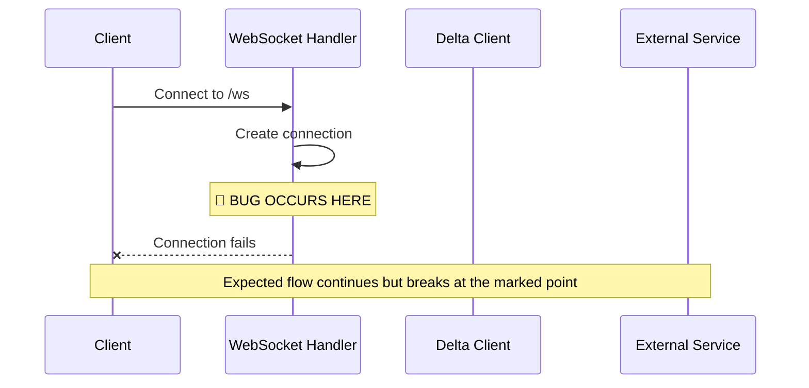

# Bug Report Template

**Version:** 1.0  
**Template Usage:** Copy this template for each new bug report

---

## File Naming Convention

**Format**: `NN-bug-NN-<kebab-case-title>.md`

**Examples**:
- `01-bug-01-websocket-connection-leak.md`
- `02-bug-02-race-condition-subscription-map.md` 
- `03-bug-03-missing-error-handling-delta-client.md`

**Index Rules**:
- Bug numbers are sequential across all phases
- First number: Overall bug sequence (01, 02, 03...)
- Second number: Same as first (redundancy for clarity)
- Title: Short, descriptive, kebab-case

---

## Template Structure

```markdown
# [Bug Title] - [Severity Level]

**Bug ID**: NN-bug-NN  
**Discovery Phase**: Phase X.Y  
**Severity**: Critical | High | Medium | Low  
**Status**: Open | In Progress | Fixed | Verified  
**Reporter**: [Name/Tool]  
**Date Discovered**: YYYY-MM-DD  

---

## What

### Problem Description
[Clear, concise description of what is broken or not working as expected]

### Expected Behavior
[What should happen under normal circumstances]

### Actual Behavior  
[What actually happens, including error messages, unexpected outputs, or system behavior]

### Impact Assessment
[How this bug affects the system, users, or other components]

---

## Where

### Affected Files
| File Path | Line Numbers | Component |
|-----------|-------------|-----------|
| `path/to/file.go` | Lines X-Y | [Component name] |
| `path/to/other.go` | Line Z | [Component name] |

### Code Context
```go
// Problematic code section with sufficient context
// Include 3-5 lines before and after the issue
```

### Related Configuration
[Any relevant configuration files, environment variables, or settings]

---

## Reproduction Steps

### Prerequisites
[Any setup requirements, dependencies, or initial conditions]

### Step-by-Step Instructions
1. [First step with exact commands/actions]
   ```bash
   # Command example
   make build
   ```

2. [Second step with expected output]
   ```bash
   # Command with output
   curl -v http://localhost:8080/ws
   # Expected: WebSocket upgrade
   # Actual: Connection refused
   ```

3. [Continue until bug is reproduced]

### Reproduction Success Rate
[How often the bug can be reproduced: Always | Sometimes (X%) | Rare]

### Environment Information
- **OS**: [Operating system and version]
- **Go Version**: [go version output]
- **Dependencies**: [Relevant package versions]
- **Configuration**: [Environment/config details]

---

## Flow Diagram



[Additional diagrams as needed - architecture, data flow, state transitions]

---

## Solution Space

### Approach 1: [Solution Name]
**Description**: [How this approach would fix the problem]

**Pros**:
- [Advantage 1]
- [Advantage 2]

**Cons**:
- [Disadvantage 1] 
- [Disadvantage 2]

**Implementation Effort**: [Low | Medium | High]

### Approach 2: [Alternative Solution Name]
**Description**: [How this alternative would work]

**Pros**:
- [Advantage 1]
- [Advantage 2]

**Cons**:
- [Disadvantage 1]
- [Disadvantage 2]

**Implementation Effort**: [Low | Medium | High]

### [Additional approaches as needed]

---

## Recommended Fix

### Selected Approach
**Choice**: [Selected approach with justification]

**Rationale**: [Why this approach was chosen over alternatives]

### Implementation Pseudocode
```go
// High-level pseudocode showing the fix
func fixedFunction() error {
    // 1. Add proper error handling
    if err := validateInput(); err != nil {
        return fmt.Errorf("validation failed: %w", err)
    }
    
    // 2. Fix the core issue
    defer cleanup() // Ensure resources are cleaned up
    
    // 3. Add proper logging
    log.Info("Operation completed successfully")
    return nil
}
```

### Specific Changes Required
1. **File**: `path/to/file.go`
   - **Line X**: Add null check before dereferencing pointer
   - **Line Y**: Add defer statement for resource cleanup
   - **Line Z**: Replace panic with proper error return

2. **File**: `path/to/config.yaml`
   - **Add**: Missing configuration key for timeout
   - **Update**: Default value for connection limit

### Dependencies
[Any new dependencies, imports, or external requirements]

---

## Verification Steps

### Test Case 1: Basic Functionality
```bash
# Commands to verify the fix works
make build
make run &
SERVICE_PID=$!

# Test the fixed behavior
curl -v http://localhost:8080/ws
# Expected: Successful WebSocket upgrade

kill $SERVICE_PID
```

### Test Case 2: Edge Cases
```bash
# Test edge cases and error conditions
[Commands to test edge cases]
```

### Test Case 3: Regression Prevention
```bash
# Ensure existing functionality still works
go test ./...
# Expected: All tests pass
```

### Automated Tests
```go
// Example test case to prevent regression
func TestWebSocketConnectionHandling(t *testing.T) {
    // Test implementation
}
```

---

## Additional Notes

### Root Cause Analysis
[Deeper analysis of why this bug exists - design flaw, oversight, race condition, etc.]

### Prevention Measures
[How similar bugs can be prevented in the future - code review practices, automated tests, etc.]

### Related Issues
[Links to related bugs, GitHub issues, or documentation]

### References
[External documentation, Stack Overflow posts, or other resources consulted]

---

## Changelog

| Date | Action | Notes |
|------|--------|-------|
| YYYY-MM-DD | Created | Initial bug report |
| YYYY-MM-DD | Updated | Added reproduction steps |
| YYYY-MM-DD | Fixed | Implemented solution |
| YYYY-MM-DD | Verified | Confirmed fix works |

---

## Attachments

[List any log files, screenshots, configuration files, or other supporting materials]

- `build-verification.log` - Build output showing the error
- `websocket-analysis.log` - Network analysis of the connection
- `system-state.json` - System state when bug occurred
```

---

## Template Usage Guidelines

### When to Create a Bug Report
- Any deviation from expected behavior
- Performance issues or resource leaks
- Security vulnerabilities
- Configuration problems
- Integration failures

### Severity Classification

| Severity | Definition | Examples |
|----------|------------|----------|
| **Critical** | System crash, data loss, security breach | Service won't start, data corruption |
| **High** | Major functionality broken, severe performance | WebSocket connections fail, memory leak |
| **Medium** | Feature partially broken, moderate impact | Some subscriptions don't work, slow response |
| **Low** | Minor issue, cosmetic problem, edge case | Unclear error message, minor performance |

### Quality Checklist

Before submitting a bug report, ensure:

- [ ] Title is descriptive and specific
- [ ] Severity is appropriately classified  
- [ ] File paths and line numbers are accurate
- [ ] Reproduction steps are complete and tested
- [ ] Flow diagram clearly shows where failure occurs
- [ ] Multiple solution approaches are considered
- [ ] Recommended fix includes pseudocode
- [ ] Verification steps are comprehensive
- [ ] All required sections are completed

### Review Process

1. **Self-Review**: Check against quality checklist
2. **Technical Review**: Validate technical accuracy
3. **Priority Assignment**: Confirm severity and urgency
4. **Solution Review**: Evaluate proposed approaches
5. **Approval**: Ready for implementation

---

**Next Steps After Bug Report Creation:**
1. Update `docs/bugs/00-overview_of_bugs.md` with new entry
2. Consider if new rules should be added to `.cursor/rules/`
3. Continue with next phase of verification playbook
4. If critical bug, consider immediate fix before continuing 