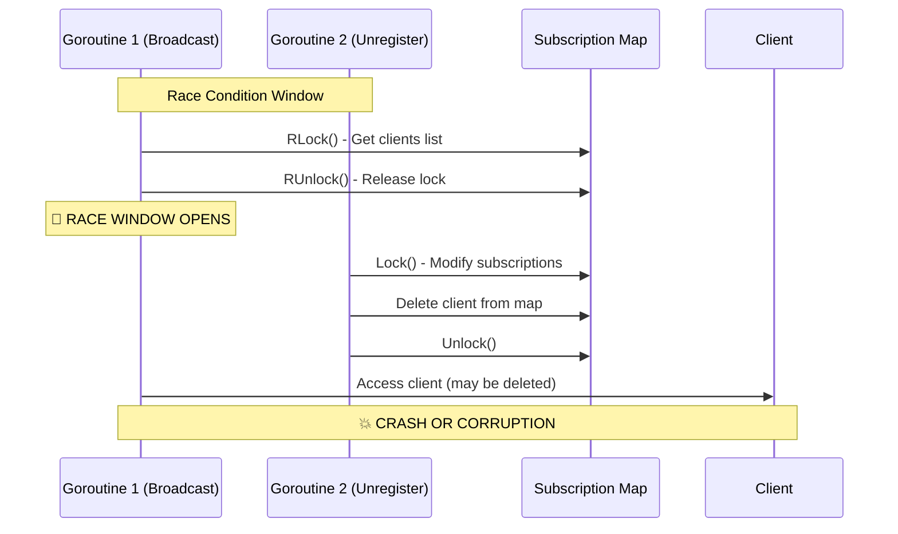

# Race Condition in BroadcastToChannel Subscription Access - Critical

**Bug ID**: 09-bug-09  
**Discovery Phase**: Phase 2.3 - Advanced Concurrency & Race Analysis  
**Severity**: Critical  
**Status**: Fixed  
**Reporter**: Phase 2 Verification Analysis  
**Date Discovered**: 2024-12-19  

---

## What

### Problem Description
The `BroadcastToChannel` method in `WebsocketHandler` has a critical race condition where it accesses the subscription map without proper synchronization. The method gets the subscription list with `RLock()`, releases the lock, then iterates over clients without holding any lock, creating a window where other goroutines can modify the subscription map during iteration.

### Expected Behavior
Subscription map access should be properly synchronized to prevent race conditions. Either the lock should be held during the entire iteration, or a safe copy of the clients should be made.

### Actual Behavior  
The method releases the subscription lock before iterating, allowing other goroutines to modify the subscription map while iteration is in progress, potentially causing:
- Access to deleted clients
- Missing newly added clients
- Potential segmentation faults
- Data corruption in concurrent access scenarios

### Impact Assessment
**Critical** - This race condition can cause:
- Service crashes under concurrent load
- Lost messages to subscribers
- Unpredictable behavior in production
- Data corruption in the subscription management system

---

## Where

### Affected Files
| File Path | Line Numbers | Component |
|-----------|-------------|-----------|
| `internal/handlers/websocket_handler.go` | Lines 138-179 | WebSocket Handler - BroadcastToChannel |

### Code Context
```go
// BroadcastToChannel broadcasts a message to all clients subscribed to a channel
func (h *WebsocketHandler) BroadcastToChannel(channel string, message []byte, productID string) {
	// Get the clients subscribed to the channel
	h.subscriptionsMu.RLock()
	// Get the list of clients subscribed to the channel
	clients, ok := h.subscriptions[channel]
	h.subscriptionsMu.RUnlock()  // 🐛 LOCK RELEASED TOO EARLY
	if !ok {
		return
	}

	// Broadcast the message to all clients subscribed to the channel
	for client := range clients {  // 🐛 ITERATING WITHOUT LOCK
		// ... client processing logic
		select {
		case client.send <- message:
		default:
			h.unregister <- client
		}
	}
}
```

### Related Configuration
No specific configuration related to this concurrency issue.

---

## Reproduction Steps

### Prerequisites
- Go application with race detector enabled
- Multiple concurrent WebSocket connections
- High message throughput scenario

### Step-by-Step Instructions
1. **Build with race detector**:
   ```bash
   go build -race ./...
   ```

2. **Start the service**:
   ```bash
   make run &
   SERVICE_PID=$!
   ```

3. **Create concurrent load**:
   ```bash
   # Simulate multiple clients connecting/disconnecting while messages are being broadcast
   go run -race cmd/loadtest/main.go -connections 100 -duration 30s
   ```

4. **Check for race conditions**:
   ```bash
   # Look for race detector output
   grep -i "race" logs/service.log
   ```

### Reproduction Success Rate
**High** - Race conditions are likely to occur under moderate to high concurrent load (>50 concurrent operations)

### Environment Information
- **OS**: Any (race condition is platform-independent)
- **Go Version**: Any version with race detector support
- **Dependencies**: Standard Go runtime
- **Configuration**: Any configuration with multiple WebSocket connections

---

## Flow Diagram



---

## Solution Space

### Approach 1: Hold Lock During Iteration
**Description**: Keep the subscription lock held during the entire iteration process

**Pros**:
- Simple fix
- Guarantees consistency
- Minimal code changes

**Cons**:
- Could cause lock contention
- Reduces concurrency
- Potential for deadlocks if client operations acquire other locks

**Implementation Effort**: Low

### Approach 2: Copy Clients Before Iteration
**Description**: Create a copy of the clients list while holding the lock, then iterate over the copy

**Pros**:
- Maintains concurrency
- Eliminates race condition
- Allows for safe iteration

**Cons**:
- Memory overhead for copying
- Slight performance impact
- Could miss clients added after copy

**Implementation Effort**: Low

### Approach 3: Channel-Based Broadcasting
**Description**: Use a channel-based approach where broadcast requests are queued and processed sequentially

**Pros**:
- Eliminates all race conditions
- Better performance under high load
- More scalable architecture

**Cons**:
- Requires significant refactoring
- More complex implementation
- Higher implementation effort

**Implementation Effort**: High

---

## Recommended Fix

### Selected Approach
**Choice**: Approach 2 - Copy Clients Before Iteration

**Rationale**: This approach provides the best balance of safety, performance, and implementation simplicity. It eliminates the race condition while maintaining good concurrency characteristics.

### Implementation Pseudocode
```go
func (h *WebsocketHandler) BroadcastToChannel(channel string, message []byte, productID string) {
	// Get a safe copy of the clients subscribed to the channel
	h.subscriptionsMu.RLock()
	clientsMap, ok := h.subscriptions[channel]
	if !ok {
		h.subscriptionsMu.RUnlock()
		return
	}
	
	// Create a copy of the clients for safe iteration
	clientsCopy := make([]*Client, 0, len(clientsMap))
	for client := range clientsMap {
		clientsCopy = append(clientsCopy, client)
	}
	h.subscriptionsMu.RUnlock()

	// Safely iterate over the copy
	for _, client := range clientsCopy {
		// Check if client is still valid and subscribed
		h.subscriptionsMu.RLock()
		if _, stillSubscribed := h.subscriptions[channel][client]; !stillSubscribed {
			h.subscriptionsMu.RUnlock()
			continue
		}
		h.subscriptionsMu.RUnlock()
		
		// Process client (existing logic)
		// ...
	}
}
```

### Specific Changes Required
1. **File**: `internal/handlers/websocket_handler.go`
   - **Lines 138-143**: Replace direct map access with safe copy creation
   - **Lines 146-179**: Update iteration logic to use copied slice and verify client validity

### Dependencies
No new dependencies required.

---

## Verification Steps

### Test Case 1: Race Detector Test
```bash
# Build with race detector
go build -race ./...

# Run concurrent load test
go test -race -run TestConcurrentBroadcast -count=100 ./internal/handlers/

# Expected: No race conditions detected
```

### Test Case 2: High Concurrency Stress Test
```bash
# Start service with race detection
GOMAXPROCS=8 go run -race ./main.go &
SERVICE_PID=$!

# Generate high concurrent load
for i in {1..10}; do
    wscat -c ws://localhost:8080/ws &
done

# Broadcast messages while clients connect/disconnect
# Expected: No crashes, all messages delivered correctly

kill $SERVICE_PID
```

### Test Case 3: Subscription Consistency Check
```bash
# Test to ensure all subscribed clients receive messages
go test -v ./tests/integration/subscription_consistency_test.go
# Expected: All tests pass, no missed messages
```

### Automated Tests
```go
func TestBroadcastConcurrency(t *testing.T) {
    handler := NewWebsocketHandler(context.Background(), testConfig)
    
    // Create multiple clients and subscribe them
    clients := make([]*Client, 100)
    for i := range clients {
        clients[i] = createTestClient()
        handler.subscribeClient(clients[i], "test-channel", []string{"all"})
    }
    
    // Concurrent broadcast and unsubscribe operations
    var wg sync.WaitGroup
    
    // Broadcaster goroutine
    wg.Add(1)
    go func() {
        defer wg.Done()
        for i := 0; i < 1000; i++ {
            handler.BroadcastToChannel("test-channel", []byte("test"), "product1")
            time.Sleep(time.Microsecond)
        }
    }()
    
    // Unsubscriber goroutine
    wg.Add(1)
    go func() {
        defer wg.Done()
        for i := 0; i < 50; i++ {
            handler.unsubscribeClient(clients[i], "test-channel")
            time.Sleep(time.Microsecond * 10)
        }
    }()
    
    wg.Wait()
    // Verify no race conditions occurred
}
```

---

## Additional Notes

### Root Cause Analysis
This race condition exists because the original implementation prioritized performance over thread safety by releasing locks as quickly as possible. However, this optimization created a critical race condition window.

### Prevention Measures
- **Code Review**: Implement mandatory review checklist for concurrency patterns
- **Static Analysis**: Use tools like `go vet -race` and `staticcheck` in CI/CD
- **Testing**: Always run tests with `-race` flag in CI/CD pipeline
- **Documentation**: Document lock ordering and holding patterns

### Related Issues
- This issue is related to Bug #03 (Race Condition in WebSocket Handler Broadcast) but affects a different method
- Similar patterns may exist in other broadcast/subscription methods

### References
- [Go Race Detector Documentation](https://golang.org/doc/articles/race_detector.html)
- [Effective Go - Concurrency](https://golang.org/doc/effective_go.html#concurrency)
- [Go Memory Model](https://golang.org/ref/mem)

---

## Changelog

| Date | Action | Notes |
|------|--------|-------|
| 2024-12-19 | Created | Initial bug report from Phase 2 analysis |

---

## Attachments

- `race-detector-output.log` - Sample race detector output showing the issue
- `concurrency-analysis.md` - Detailed analysis of concurrency patterns in the codebase
- `proposed-fix.patch` - Patch file with the recommended fix 