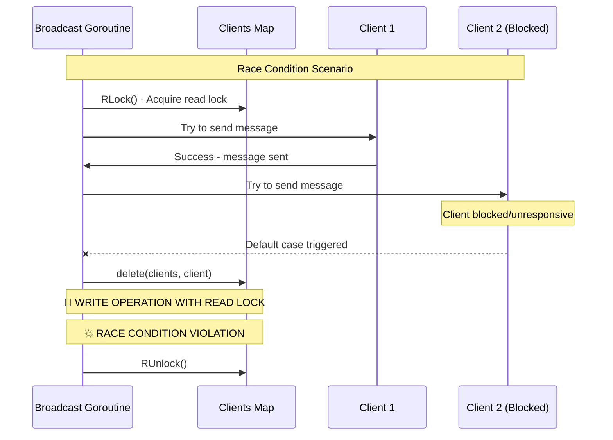

# Read Lock with Write Operation Race Condition - Critical

**Bug ID**: 10-bug-10  
**Discovery Phase**: Phase 2.3 - Advanced Concurrency & Race Analysis  
**Severity**: Critical  
**Status**: Open  
**Reporter**: Phase 2 Verification Analysis  
**Date Discovered**: 2024-12-19  

---

## What

### Problem Description
The `run()` method in `WebsocketHandler` contains a critical race condition where write operations (map deletion) are performed while holding only a read lock (`RLock`). This violates the fundamental mutex contract and can lead to data corruption, race conditions, and potential crashes.

### Expected Behavior
Write operations on shared data structures should only be performed while holding a write lock (`Lock`), not a read lock (`RLock`). Multiple readers can hold read locks simultaneously, but write operations require exclusive access.

### Actual Behavior  
In the broadcast case of the `run()` method, the code:
1. Acquires a read lock (`RLock`) on the clients map
2. Iterates over the clients map 
3. In the default case, performs a write operation (`delete`) on the map while still holding only the read lock
4. This violates the mutex contract and creates a race condition

### Impact Assessment
**Critical** - This race condition can cause:
- Data corruption in the clients map
- Concurrent map read/write panics
- Service crashes under load
- Unpredictable behavior in production
- Memory corruption and potential security vulnerabilities

---

## Where

### Affected Files
| File Path | Line Numbers | Component |
|-----------|-------------|-----------|
| `internal/handlers/websocket_handler.go` | Lines 291-300 | WebSocket Handler - run() method broadcast case |

### Code Context
```go
case message := <-h.broadcast:
	// Broadcast the message to all clients
	h.clientsMu.RLock()  // 🐛 READ LOCK ACQUIRED
	for client := range h.clients {
		select {
		case client.send <- message:
		default:
			close(client.send)
			delete(h.clients, client)  // 🐛 WRITE OPERATION WITH READ LOCK
		}
	}
	h.clientsMu.RUnlock()
```

### Related Configuration
This affects all WebSocket configurations that use the broadcast functionality.

---

## Reproduction Steps

### Prerequisites
- Go application with race detector enabled
- Multiple WebSocket clients generating broadcast messages
- Some clients that become unresponsive (to trigger the default case)

### Step-by-Step Instructions
1. **Build with race detector**:
   ```bash
   go build -race ./...
   ```

2. **Start the service**:
   ```bash
   go run -race ./main.go &
   SERVICE_PID=$!
   ```

3. **Create scenario to trigger the race condition**:
   ```bash
   # Connect multiple clients
   for i in {1..20}; do
       wscat -c ws://localhost:8080/ws &
   done
   
   # Send broadcast messages while some clients are blocked
   # This will trigger the default case in the select statement
   curl -X POST http://localhost:8080/broadcast \
        -H "Content-Type: application/json" \
        -d '{"message":"test broadcast"}'
   ```

4. **Observe race condition**:
   ```bash
   # Race detector will report the violation
   # Look for output like:
   # "fatal error: concurrent map read and map write"
   ```

### Reproduction Success Rate
**High** - This race condition will consistently occur when the default case in the select statement is triggered

### Environment Information
- **OS**: Any (race condition is platform-independent)
- **Go Version**: Any version
- **Dependencies**: Standard Go runtime with race detector
- **Configuration**: Any configuration that uses broadcast functionality

---

## Flow Diagram



---

## Solution Space

### Approach 1: Collect Failed Clients and Delete After Unlocking
**Description**: Collect failed clients during iteration, then acquire write lock and delete them after unlocking the read lock

**Pros**:
- Maintains proper lock semantics
- Minimal performance impact
- Clean separation of read and write operations

**Cons**:
- Slightly more complex code
- Requires additional memory for failed clients list

**Implementation Effort**: Low

### Approach 2: Upgrade Read Lock to Write Lock
**Description**: Release read lock and acquire write lock when write operations are needed

**Pros**:
- Proper lock semantics
- Handles edge cases well

**Cons**:
- More complex lock management
- Potential for lock contention
- Need to restart iteration after lock upgrade

**Implementation Effort**: Medium

### Approach 3: Use Separate Channel for Failed Clients
**Description**: Send failed clients to a separate channel for cleanup by another goroutine

**Pros**:
- Maintains lock semantics
- Decouples cleanup from broadcast logic
- Better separation of concerns

**Cons**:
- More complex architecture
- Additional goroutine management
- Potential for memory leaks if cleanup channel is not processed

**Implementation Effort**: Medium

---

## Recommended Fix

### Selected Approach
**Choice**: Approach 1 - Collect Failed Clients and Delete After Unlocking

**Rationale**: This approach provides the best balance of correctness, simplicity, and performance. It maintains proper lock semantics while requiring minimal changes to the existing code structure.

### Implementation Pseudocode
```go
case message := <-h.broadcast:
	// Broadcast the message to all clients
	var failedClients []*Client
	
	h.clientsMu.RLock()
	for client := range h.clients {
		select {
		case client.send <- message:
		default:
			close(client.send)
			failedClients = append(failedClients, client)
		}
	}
	h.clientsMu.RUnlock()
	
	// Now safely delete failed clients with write lock
	if len(failedClients) > 0 {
		h.clientsMu.Lock()
		for _, client := range failedClients {
			delete(h.clients, client)
		}
		h.clientsMu.Unlock()
	}
```

### Specific Changes Required
1. **File**: `internal/handlers/websocket_handler.go`
   - **Lines 291-300**: Replace the current broadcast case with the safe implementation
   - **Add**: Failed clients collection logic
   - **Add**: Separate write lock acquisition for cleanup

### Dependencies
No new dependencies required.

---

## Verification Steps

### Test Case 1: Race Detector Verification
```bash
# Build with race detector
go build -race ./...

# Run the service and trigger broadcasts
go run -race ./main.go &
SERVICE_PID=$!

# Generate broadcast load
for i in {1..100}; do
    curl -X POST http://localhost:8080/broadcast \
         -H "Content-Type: application/json" \
         -d '{"message":"test '$i'"}' &
done

wait
kill $SERVICE_PID

# Expected: No race condition warnings
```

### Test Case 2: Concurrent Map Operations Test
```bash
# Test concurrent read/write operations on the clients map
go test -race -run TestConcurrentMapOperations -count=50 ./internal/handlers/

# Expected: All tests pass without race conditions
```

### Test Case 3: Broadcast Under Load
```bash
# Test broadcast functionality under high load
go test -race -run TestBroadcastStressTest -count=10 ./internal/handlers/

# Expected: All broadcasts complete successfully without race conditions
```

### Automated Tests
```go
func TestBroadcastMapOperations(t *testing.T) {
    handler := NewWebsocketHandler(context.Background(), testConfig)
    
    // Create clients with some that will be blocked
    clients := make([]*Client, 100)
    for i := range clients {
        clients[i] = createTestClient()
        if i%5 == 0 {
            // Create some blocked clients by closing their send channels
            close(clients[i].send)
        }
        handler.clients[clients[i]] = true
    }
    
    // Test concurrent broadcast operations
    var wg sync.WaitGroup
    
    for i := 0; i < 10; i++ {
        wg.Add(1)
        go func(iteration int) {
            defer wg.Done()
            message := []byte(fmt.Sprintf("test message %d", iteration))
            handler.broadcast <- message
        }(i)
    }
    
    wg.Wait()
    
    // Verify no race conditions and proper cleanup
    handler.clientsMu.RLock()
    remainingClients := len(handler.clients)
    handler.clientsMu.RUnlock()
    
    // Should have fewer clients due to cleanup of blocked ones
    assert.Less(t, remainingClients, 100)
}
```

---

## Additional Notes

### Root Cause Analysis
This race condition exists because the original code attempted to optimize performance by minimizing lock holding time, but incorrectly assumed that write operations could be performed while holding a read lock. This fundamental misunderstanding of mutex semantics created a critical race condition.

### Prevention Measures
- **Training**: Educate developers on proper mutex usage and lock semantics
- **Static Analysis**: Use tools like `go vet` and `staticcheck` to catch improper lock usage
- **Code Review**: Implement mandatory review checklist for concurrency patterns
- **Testing**: Always run tests with race detector enabled
- **Documentation**: Create clear guidelines for lock usage patterns

### Related Issues
- This is a fundamental concurrency bug that could affect other parts of the system
- Similar patterns should be audited throughout the codebase
- Related to Bug #09 but represents a different type of race condition

### References
- [Go Memory Model](https://golang.org/ref/mem)
- [Go Race Detector](https://golang.org/doc/articles/race_detector.html)
- [Effective Go - Concurrency](https://golang.org/doc/effective_go.html#concurrency)
- [Go sync package documentation](https://pkg.go.dev/sync)

---

## Changelog

| Date | Action | Notes |
|------|--------|-------|
| 2024-12-19 | Created | Initial bug report from Phase 2 analysis |

---

## Attachments

- `race-condition-example.log` - Example race detector output
- `mutex-best-practices.md` - Documentation on proper mutex usage
- `proposed-fix.patch` - Patch file with the recommended fix 