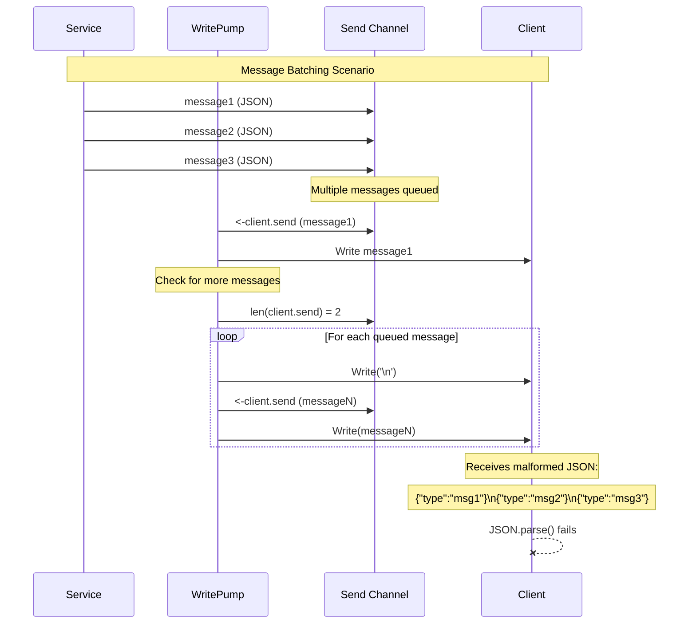

# Malformed JSON Message Batching - High

**Bug ID**: 11-bug-11  
**Discovery Phase**: Phase 2.1 - Protocol-Compliance Verification  
**Severity**: High  
**Status**: Open  
**Reporter**: Phase 2 Verification Analysis  
**Date Discovered**: 2024-12-19  

---

## What

### Problem Description
The `writePump` method in the WebSocket handler batches multiple JSON messages by concatenating them with newline characters, creating malformed JSON output. When multiple messages are queued, they are combined as separate JSON objects separated by newlines, which violates JSON specification and can cause client-side parsing failures.

### Expected Behavior
Each JSON message should be sent as a separate WebSocket frame, or if batching is required, messages should be properly formatted as a JSON array or sent with appropriate delimiters that clients can handle.

### Actual Behavior  
The current implementation concatenates multiple JSON messages with newlines:
```
{"type":"message1","data":"..."}
{"type":"message2","data":"..."}
{"type":"message3","data":"..."}
```

This creates invalid JSON that cannot be parsed as a single JSON object, forcing clients to implement custom parsing logic.

### Impact Assessment
**High** - This protocol violation can cause:
- Client-side JSON parsing failures
- Message loss when clients cannot parse batched messages
- Incompatibility with standard JSON parsers
- Increased client complexity to handle malformed JSON
- Potential security vulnerabilities from custom parsing logic

---

## Where

### Affected Files
| File Path | Line Numbers | Component |
|-----------|-------------|-----------|
| `internal/handlers/websocket_handler.go` | Lines 380-394 | WebSocket Handler - writePump message batching |

### Code Context
```go
case message, ok := <-client.send:
	// ... error handling ...
	
	w, err := client.conn.NextWriter(websocket.TextMessage)
	if err != nil {
		return
	}
	w.Write(message)  // First JSON message
	
	// Add queued messages to the current websocket message
	n := len(client.send)
	for i := 0; i < n; i++ {
		w.Write([]byte{'\n'})  // 🐛 NEWLINE SEPARATOR
		msg := <-client.send
		w.Write(msg)  // 🐛 CONCATENATED JSON OBJECTS
		atomic.AddInt64(&h.messagesSent, 1)
	}
	
	if err := w.Close(); err != nil {
		return
	}
```

### Related Configuration
Affects all WebSocket message delivery when message queues build up.

---

## Reproduction Steps

### Prerequisites
- WebSocket client that can connect to the service
- Scenario that causes message queuing (slow client or high message rate)
- JSON parser to verify message format

### Step-by-Step Instructions
1. **Start the WebSocket service**:
   ```bash
   make run &
   SERVICE_PID=$!
   ```

2. **Connect a WebSocket client**:
   ```bash
   # Using wscat with slow processing to cause message queuing
   wscat -c ws://localhost:8080/ws
   ```

3. **Subscribe to a high-frequency channel**:
   ```json
   {
     "type": "subscribe",
     "payload": {
       "channels": [
         {
           "name": "ticker",
           "symbols": ["all"]
         }
       ]
     }
   }
   ```

4. **Generate rapid messages to cause batching**:
   ```bash
   # Simulate high-frequency updates that will queue up
   for i in {1..10}; do
     curl -X POST http://localhost:8080/broadcast \
          -H "Content-Type: application/json" \
          -d '{"channel":"ticker","message":"update '$i'"}' &
   done
   ```

5. **Observe malformed JSON output**:
   ```bash
   # Client will receive something like:
   # {"type":"ticker","data":"update 1"}
   # {"type":"ticker","data":"update 2"}
   # {"type":"ticker","data":"update 3"}
   ```

### Reproduction Success Rate
**High** - Batching occurs whenever the client.send channel has multiple messages queued

### Environment Information
- **OS**: Any
- **Go Version**: Any
- **Dependencies**: gorilla/websocket
- **Configuration**: Any configuration with message batching

---

## Flow Diagram



---

## Solution Space

### Approach 1: Send Each Message Separately
**Description**: Remove batching entirely and send each message as a separate WebSocket frame

**Pros**:
- Simple implementation
- Standards-compliant JSON
- No parsing complexity for clients
- Clear message boundaries

**Cons**:
- More WebSocket frames
- Potential performance impact under high load
- May not utilize WebSocket framing efficiency

**Implementation Effort**: Low

### Approach 2: JSON Array Batching
**Description**: Batch messages into a proper JSON array format

**Pros**:
- Standards-compliant JSON
- Efficient batching
- Single parse operation for clients
- Maintains batching benefits

**Cons**:
- Clients need to handle both single messages and arrays
- More complex parsing logic
- Potential memory usage for large batches

**Implementation Effort**: Medium

### Approach 3: Length-Prefixed Messages
**Description**: Use length prefixes or proper delimiters for each message

**Pros**:
- Efficient parsing
- Clear message boundaries
- Maintains individual JSON objects

**Cons**:
- Non-standard approach
- Requires custom client parsing
- More complex protocol

**Implementation Effort**: Medium

### Approach 4: Configurable Batching Strategy
**Description**: Make batching behavior configurable with multiple strategies

**Pros**:
- Flexible approach
- Can optimize per use case
- Backwards compatibility options

**Cons**:
- Most complex implementation
- Configuration complexity
- Testing overhead

**Implementation Effort**: High

---

## Recommended Fix

### Selected Approach
**Choice**: Approach 1 - Send Each Message Separately

**Rationale**: This approach prioritizes protocol compliance and client simplicity over potential performance optimizations. WebSocket is designed to handle multiple frames efficiently, and standards compliance is more important than marginal performance gains.

### Implementation Pseudocode
```go
case message, ok := <-client.send:
	client.conn.SetWriteDeadline(time.Now().Add(10 * time.Second))
	if !ok {
		client.conn.WriteMessage(websocket.CloseMessage, []byte{})
		return
	}

	// Send the primary message
	if err := client.conn.WriteMessage(websocket.TextMessage, message); err != nil {
		return
	}
	atomic.AddInt64(&h.messagesSent, 1)

	// Send any additional queued messages separately
	n := len(client.send)
	for i := 0; i < n; i++ {
		msg := <-client.send
		if err := client.conn.WriteMessage(websocket.TextMessage, msg); err != nil {
			return
		}
		atomic.AddInt64(&h.messagesSent, 1)
	}
```

### Alternative Implementation (JSON Array Option)
```go
case message, ok := <-client.send:
	client.conn.SetWriteDeadline(time.Now().Add(10 * time.Second))
	if !ok {
		client.conn.WriteMessage(websocket.CloseMessage, []byte{})
		return
	}

	// Collect all queued messages
	messages := []json.RawMessage{json.RawMessage(message)}
	n := len(client.send)
	for i := 0; i < n; i++ {
		msg := <-client.send
		messages = append(messages, json.RawMessage(msg))
	}

	// Send as JSON array if multiple messages, single message otherwise
	var payload []byte
	var err error
	if len(messages) == 1 {
		payload = messages[0]
	} else {
		payload, err = json.Marshal(messages)
		if err != nil {
			return
		}
	}

	if err := client.conn.WriteMessage(websocket.TextMessage, payload); err != nil {
		return
	}
	atomic.AddInt64(&h.messagesSent, int64(len(messages)))
```

### Specific Changes Required
1. **File**: `internal/handlers/websocket_handler.go`
   - **Lines 380-394**: Replace newline concatenation with separate message sending
   - **Remove**: Newline separator logic
   - **Update**: Message counting logic

### Dependencies
No new dependencies required for Approach 1. JSON array approach requires standard `encoding/json` package.

---

## Verification Steps

### Test Case 1: Single Message Validation
```bash
# Test that single messages are properly formatted JSON
wscat -c ws://localhost:8080/ws
# Send: {"type":"subscribe","payload":{"channels":[{"name":"test","symbols":["all"]}]}}
# Expected: Valid JSON response that can be parsed

echo '{"type":"subscribe","payload":{"channels":[{"name":"test","symbols":["all"]}]}}' | \
  wscat -c ws://localhost:8080/ws | jq '.' # Should parse without errors
```

### Test Case 2: Multiple Message Validation
```bash
# Generate scenario with message queuing
go run test/message_batching_test.go
# Expected: Each received message is valid JSON
```

### Test Case 3: High-Frequency Message Test
```bash
# Test under high message load
go test -run TestHighFrequencyMessages ./internal/handlers/
# Expected: All messages received are valid JSON, no parsing errors
```

### Automated Tests
```go
func TestMessageFormatCompliance(t *testing.T) {
    handler := NewWebsocketHandler(context.Background(), testConfig)
    client := createTestClient()
    
    // Queue multiple messages
    messages := []string{
        `{"type":"message1","data":"test1"}`,
        `{"type":"message2","data":"test2"}`,
        `{"type":"message3","data":"test3"}`,
    }
    
    for _, msg := range messages {
        client.send <- []byte(msg)
    }
    
    // Capture output from writePump
    var receivedMessages []string
    
    // Mock the WebSocket connection to capture written data
    mockConn := &MockWebSocketConn{
        writeHandler: func(messageType int, data []byte) error {
            // Verify each message is valid JSON
            var jsonObj interface{}
            if err := json.Unmarshal(data, &jsonObj); err != nil {
                t.Errorf("Received invalid JSON: %s, error: %v", string(data), err)
            }
            receivedMessages = append(receivedMessages, string(data))
            return nil
        },
    }
    
    client.conn = mockConn
    
    // Run writePump and verify output
    go handler.writePump(client)
    
    // Wait for processing
    time.Sleep(100 * time.Millisecond)
    
    // Verify all messages were received and are valid JSON
    assert.Equal(t, len(messages), len(receivedMessages))
    for i, received := range receivedMessages {
        var jsonObj interface{}
        assert.NoError(t, json.Unmarshal([]byte(received), &jsonObj))
    }
}
```

---

## Additional Notes

### Root Cause Analysis
The batching logic was implemented to optimize WebSocket performance by reducing the number of individual write operations. However, it failed to consider JSON format requirements and client parsing capabilities, prioritizing performance over protocol compliance.

### Prevention Measures
- **Protocol Testing**: Implement automated tests that verify message format compliance
- **Client Testing**: Test with standard JSON parsers to ensure compatibility
- **Standards Review**: Review all message formatting against relevant standards (JSON, WebSocket)
- **Documentation**: Document expected message formats and batching behavior
- **Integration Testing**: Test with multiple client implementations

### Related Issues
- This affects all clients consuming WebSocket messages
- May be related to any custom parsing logic clients have implemented
- Could impact message delivery reliability

### References
- [JSON Specification (RFC 7159)](https://tools.ietf.org/html/rfc7159)
- [WebSocket Protocol (RFC 6455)](https://tools.ietf.org/html/rfc6455)
- [WebSocket API Standards](https://developer.mozilla.org/en-US/docs/Web/API/WebSockets_API)

---

## Changelog

| Date | Action | Notes |
|------|--------|-------|
| 2024-12-19 | Created | Initial bug report from Phase 2 analysis |

---

## Attachments

- `malformed-json-example.txt` - Example of malformed output
- `client-parsing-errors.log` - Client-side parsing error examples
- `protocol-compliance-test.js` - JavaScript test for JSON parsing
- `proposed-fix.patch` - Patch file with the recommended fix 