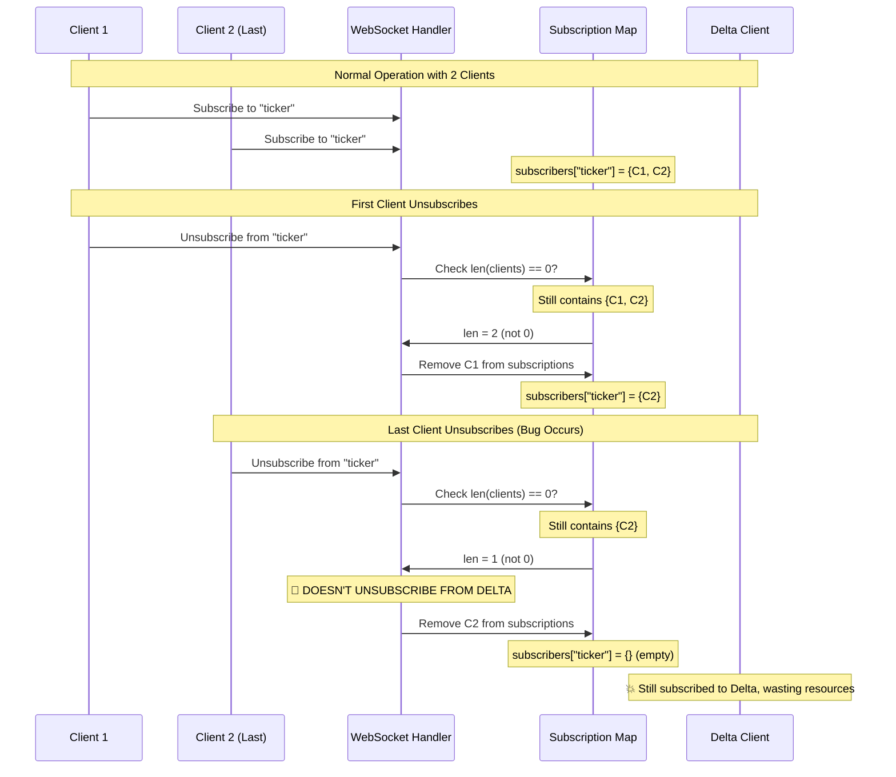

# Unsubscribe Client Count Logic Error - Medium

**Bug ID**: 12-bug-12  
**Discovery Phase**: Phase 2.1 - Protocol-Compliance Verification  
**Severity**: Medium  
**Status**: Fixed
**Reporter**: Phase 2 Verification Analysis  
**Date Discovered**: 2024-12-19  

---

## What

### Problem Description
The `handleUnsubscribe` method contains a logic error where it checks if no other clients are subscribed to a channel (`len(clients) == 0`) to decide whether to unsubscribe from the Delta Exchange, but this check happens BEFORE the current client is actually removed from the subscription. This causes the service to never unsubscribe from external channels even when the last client disconnects.

### Expected Behavior
The service should unsubscribe from the Delta Exchange channel when the last client unsubscribes from that channel. The logic should either:
1. Check the client count AFTER removing the current client, or
2. Check if `len(clients) <= 1` (meaning only the current client remains)

### Actual Behavior  
The current logic:
1. Checks `len(clients) == 0` while the current client is still in the subscription list
2. Since the current client hasn't been removed yet, `len(clients)` is never 0
3. The service continues to receive data from Delta Exchange even when no clients are subscribed
4. This wastes bandwidth and processing resources

### Impact Assessment
**Medium** - This logic error causes:
- Resource waste (continued external data consumption)
- Unnecessary network traffic from Delta Exchange
- Potential memory accumulation from unprocessed messages
- Service inefficiency under normal operation
- May lead to performance degradation over time

---

## Where

### Affected Files
| File Path | Line Numbers | Component |
|-----------|-------------|-----------|
| `internal/handlers/websocket_handler.go` | Lines 524-540 | WebSocket Handler - handleUnsubscribe Delta client logic |

### Code Context
```go
if h.deltaClient != nil {
	if channel, ok := msg["type"].(string); ok {
		if channel == "unsubscribe" {
			fmt.Println("WS_handler: Delta: unsubscribing from channel: ", channelName)
			//check if no other subscriptions exist for this channel
			if clients, ok := h.subscriptions[channelName]; ok {
				if len(clients) == 0 {  // 🐛 LOGIC ERROR: Current client still in list
					// Unsubscribe the client from the channel
					h.deltaClient.Unsubscribe(channelName)
				} else {
					fmt.Println("WS_handler: Delta: still ", len(clients), " clients subscribed to channel: ", channelName)
				}
			} else {
				// Unsubscribe the client from the channel
				h.deltaClient.Unsubscribe(channelName)
				fmt.Println("WS_handler: Delta: unsubscribed from channel: ", channelName)
			}
		}
	}
}
// Subscribe the client to the channel
h.unsubscribeClient(client, channelName)  // 🐛 CLIENT REMOVED AFTER CHECK
```

### Related Configuration
Affects all channels where Delta Exchange integration is enabled.

---

## Reproduction Steps

### Prerequisites
- WebSocket service with Delta Exchange integration enabled
- Multiple WebSocket clients
- Ability to monitor Delta Exchange subscriptions

### Step-by-Step Instructions
1. **Start the WebSocket service with debugging**:
   ```bash
   DEBUG=1 make run &
   SERVICE_PID=$!
   ```

2. **Connect multiple clients and subscribe to the same channel**:
   ```bash
   # Client 1
   wscat -c ws://localhost:8080/ws
   # Send: {"type":"subscribe","payload":{"channels":[{"name":"ticker","symbols":["all"]}]}}
   
   # Client 2 
   wscat -c ws://localhost:8080/ws
   # Send: {"type":"subscribe","payload":{"channels":[{"name":"ticker","symbols":["all"]}]}}
   ```

3. **Check Delta subscription status**:
   ```bash
   curl http://localhost:8080/stats | jq '.external_sources'
   # Should show delta: true
   ```

4. **Unsubscribe all clients one by one**:
   ```bash
   # In Client 1: {"type":"unsubscribe","payload":{"channels":[{"name":"ticker"}]}}
   # In Client 2: {"type":"unsubscribe","payload":{"channels":[{"name":"ticker"}]}}
   ```

5. **Verify Delta subscription status**:
   ```bash
   curl http://localhost:8080/stats | jq '.external_sources'
   # Bug: Will still show delta: true even with no subscribers
   ```

6. **Check service logs**:
   ```bash
   # Should see messages like:
   # "WS_handler: Delta: still 1 clients subscribed to channel: ticker"
   # Even when unsubscribing the last client
   ```

### Reproduction Success Rate
**Always** - The logic error occurs every time clients unsubscribe

### Environment Information
- **OS**: Any
- **Go Version**: Any
- **Dependencies**: Standard Go runtime
- **Configuration**: Delta Exchange integration enabled

---

## Flow Diagram



---

## Solution Space

### Approach 1: Check After Client Removal
**Description**: Move the client count check to after the client has been removed from subscriptions

**Pros**:
- Simple fix
- Maintains existing logic flow
- Minimal code changes
- Clear separation of concerns

**Cons**:
- Requires restructuring the method slightly

**Implementation Effort**: Low

### Approach 2: Use <= 1 Comparison
**Description**: Change the comparison to check if there's only one client left (the current one)

**Pros**:
- Minimal code change
- Maintains current method structure
- Easy to understand

**Cons**:
- Less intuitive logic
- Doesn't address the fundamental ordering issue

**Implementation Effort**: Low

### Approach 3: Count Clients Excluding Current
**Description**: Explicitly count clients excluding the current client before removal

**Pros**:
- Clear intent
- Maintains current structure
- Easy to verify correctness

**Cons**:
- Slightly more complex logic
- Additional iteration overhead

**Implementation Effort**: Low

---

## Recommended Fix

### Selected Approach
**Choice**: Approach 1 - Check After Client Removal

**Rationale**: This approach fixes the fundamental ordering issue and makes the logic flow more intuitive. The client count check naturally belongs after the client removal operation.

### Implementation Pseudocode
```go
// Process each channel in unsubscribe request
for _, channelObj := range channels {
	if channelMap, ok := channelObj.(map[string]interface{}); ok {
		channelName, ok := channelMap["name"].(string)
		if !ok {
			continue
		}

		// First, unsubscribe the client locally
		h.unsubscribeClient(client, channelName)

		// Then check if we need to unsubscribe from Delta
		if h.deltaClient != nil {
			h.subscriptionsMu.RLock()
			clients, exists := h.subscriptions[channelName]
			clientCount := 0
			if exists {
				clientCount = len(clients)
			}
			h.subscriptionsMu.RUnlock()

			// If no clients remain, unsubscribe from Delta
			if clientCount == 0 {
				fmt.Println("WS_handler: Delta: unsubscribing from channel (last client): ", channelName)
				h.deltaClient.Unsubscribe(channelName)
			} else {
				fmt.Println("WS_handler: Delta: still", clientCount, "clients subscribed to channel:", channelName)
			}
		}
	}
}
```

### Specific Changes Required
1. **File**: `internal/handlers/websocket_handler.go`
   - **Lines 524-540**: Reorder logic to check client count after removal
   - **Move**: `h.unsubscribeClient(client, channelName)` before Delta client check
   - **Update**: Client count check logic

### Dependencies
No new dependencies required.

---

## Verification Steps

### Test Case 1: Single Client Unsubscribe
```bash
# Test that Delta unsubscribes when last client leaves
wscat -c ws://localhost:8080/ws
# Subscribe: {"type":"subscribe","payload":{"channels":[{"name":"test","symbols":["all"]}]}}
# Unsubscribe: {"type":"unsubscribe","payload":{"channels":[{"name":"test"}]}}

# Check Delta connection status
curl http://localhost:8080/stats | jq '.external_sources.delta'
# Expected: false (unsubscribed from Delta)
```

### Test Case 2: Multiple Client Scenario
```bash
# Test that Delta stays subscribed until last client leaves
# Start 3 clients, subscribe all to same channel
# Unsubscribe 2 clients - Delta should stay connected
# Unsubscribe last client - Delta should disconnect
```

### Test Case 3: Resource Usage Monitoring
```bash
# Monitor resource usage to ensure no waste after unsubscribe
go test -run TestResourceCleanup ./internal/handlers/
# Expected: Resources properly cleaned up when no subscribers remain
```

### Automated Tests
```go
func TestUnsubscribeClientCountLogic(t *testing.T) {
    handler := NewWebsocketHandler(context.Background(), testConfig)
    mockDeltaClient := &MockDeltaClient{}
    handler.deltaClient = mockDeltaClient
    
    // Create and subscribe two clients
    client1 := createTestClient()
    client2 := createTestClient()
    
    handler.subscribeClient(client1, "test-channel", []string{"all"})
    handler.subscribeClient(client2, "test-channel", []string{"all"})
    
    // Verify both clients are subscribed
    handler.subscriptionsMu.RLock()
    clients := handler.subscriptions["test-channel"]
    assert.Equal(t, 2, len(clients))
    handler.subscriptionsMu.RUnlock()
    
    // Unsubscribe first client - should NOT unsubscribe from Delta
    unsubMsg1 := map[string]interface{}{
        "type": "unsubscribe",
        "payload": map[string]interface{}{
            "channels": []interface{}{
                map[string]interface{}{"name": "test-channel"},
            },
        },
    }
    
    handler.handleUnsubscribe(client1, unsubMsg1)
    
    // Verify Delta client was NOT unsubscribed (still has client2)
    assert.False(t, mockDeltaClient.WasUnsubscribed("test-channel"))
    
    // Unsubscribe second (last) client - should unsubscribe from Delta
    unsubMsg2 := map[string]interface{}{
        "type": "unsubscribe",
        "payload": map[string]interface{}{
            "channels": []interface{}{
                map[string]interface{}{"name": "test-channel"},
            },
        },
    }
    
    handler.handleUnsubscribe(client2, unsubMsg2)
    
    // Verify Delta client WAS unsubscribed (no clients remain)
    assert.True(t, mockDeltaClient.WasUnsubscribed("test-channel"))
    
    // Verify subscription map is clean
    handler.subscriptionsMu.RLock()
    _, exists := handler.subscriptions["test-channel"]
    assert.False(t, exists)
    handler.subscriptionsMu.RUnlock()
}
```

---

## Additional Notes

### Root Cause Analysis
This bug exists because the developer focused on the subscription removal logic without considering the interaction with external service management. The check-then-act pattern was implemented without proper ordering of operations.

### Prevention Measures
- **Unit Testing**: Implement comprehensive tests for subscription lifecycle
- **Integration Testing**: Test external service interactions
- **Code Review**: Review all check-then-act patterns for proper ordering
- **State Management**: Document state transition requirements
- **Logging**: Add detailed logging for subscription state changes

### Related Issues
- May be related to resource management in other parts of the system
- Could affect other external service integrations
- Similar logic patterns should be audited

### References
- [Go Testing Best Practices](https://golang.org/doc/tutorial/add-a-test)
- [Effective Go - Error Handling](https://golang.org/doc/effective_go.html#errors)

---

## Changelog

| Date | Action | Notes |
|------|--------|-------|
| 2024-12-19 | Created | Initial bug report from Phase 2 analysis |

---

## Attachments

- `subscription-state-diagram.md` - State transition diagram for subscriptions
- `resource-usage-analysis.log` - Analysis of wasted resources
- `proposed-fix.patch` - Patch file with the recommended fix 