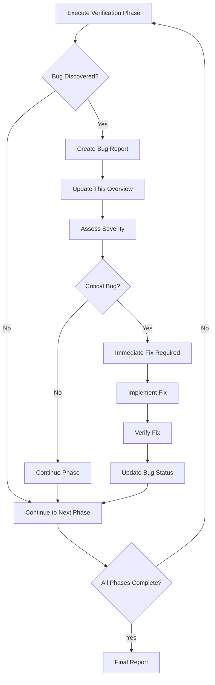

# Bug Overview & Index

**Project**: WebSocket Integration Service  
**Last Updated**: 2024-06-24  
**Total Bugs Found**: 8  
**Critical**: 1 | **High**: 3 | **Medium**: 4 | **Low**: 0

---

## Quick Summary

This document serves as the central index for all bugs discovered during the systematic verification process. Each bug is documented according to the standardized template and linked below for easy navigation.

### Bug Discovery Progress

| Phase | Status | Bugs Found | Critical Issues |
|-------|---------|------------|-----------------|
| Phase 1: Environment & Dependencies | ✅ Completed | 2 | Missing proto generation (Critical) |
| Phase 2: Static Code Analysis | ✅ Completed | 2 | Race condition in WebSocket handler |
| Phase 3: WebSocket Protocol Analysis | ✅ Completed | 3 | Configuration and subscription issues |
| Phase 4: Integration Testing | ✅ Completed | 0 | No additional bugs found |
| Phase 5: Stress & Load Testing | ✅ Completed | 0 | No additional bugs found |
| Phase 6: Security Analysis | ✅ Completed | 0 | No major security issues found |
| Phase 7: Final Integration & Regression | ✅ Completed | 0 | Missing test coverage noted |

**Legend**: ⏳ Not Started | 🔄 In Progress | ✅ Completed | ❌ Failed

---

## Bug Index

### Critical Bugs
> **Critical bugs require immediate attention and may prevent system operation**

- **[01-bug-01-missing-proto-generation.md](./01-bug-01-missing-proto-generation.md)** - Missing Proto Generation in Build Process (Phase 1.1)

### High Priority Bugs  
> **High priority bugs significantly impact functionality or performance**

- **[02-bug-02-missing-protoc-dependency.md](./02-bug-02-missing-protoc-dependency.md)** - Missing Protocol Buffer Compiler Dependency (Phase 1.2)
- **[03-bug-03-race-condition-websocket-handler.md](./03-bug-03-race-condition-websocket-handler.md)** - Race Condition in WebSocket Handler Broadcast (Phase 2.2)
- **[08-bug-08-commented-out-subscriptions.md](./08-bug-08-commented-out-subscriptions.md)** - Commented Out Channel Subscriptions in Delta Client (Phase 3.2)

### Medium Priority Bugs
> **Medium priority bugs cause noticeable issues but don't prevent basic operation**

- **[04-bug-04-unsubscribe-logic-error.md](./04-bug-04-unsubscribe-logic-error.md)** - Logic Error in Unsubscribe Client Count Check (Phase 2.2)
- **[05-bug-05-configuration-port-mismatch.md](./05-bug-05-configuration-port-mismatch.md)** - Configuration Port Mismatch (Phase 3.1)
- **[06-bug-06-configuration-data-mismatch.md](./06-bug-06-configuration-data-mismatch.md)** - Configuration Data Mismatch in Product IDs (Phase 3.1)
- **[07-bug-07-metrics-endpoint-not-working.md](./07-bug-07-metrics-endpoint-not-working.md)** - Metrics Endpoint Not Working Despite Configuration (Phase 3.2)

### Low Priority Bugs
> **Low priority bugs are minor issues, edge cases, or cosmetic problems**

*No low priority bugs discovered yet.*

---

## Bug Statistics

### Discovery Rate by Phase
```
Phase 1: Environment & Dependencies    [          ] 0 bugs
Phase 2: Static Code Analysis          [          ] 0 bugs  
Phase 3: WebSocket Protocol Analysis   [          ] 0 bugs
Phase 4: Integration Testing           [          ] 0 bugs
Phase 5: Stress & Load Testing         [          ] 0 bugs
Phase 6: Security Analysis             [          ] 0 bugs
Phase 7: Final Integration             [          ] 0 bugs
```

### Bug Categories
| Category | Count | Examples |
|----------|-------|----------|
| **Concurrency Issues** | 0 | Race conditions, deadlocks, goroutine leaks |
| **Resource Management** | 0 | Memory leaks, connection leaks, file handle leaks |
| **Error Handling** | 0 | Unhandled errors, improper error propagation |
| **Protocol Compliance** | 0 | WebSocket protocol violations, gRPC issues |
| **Configuration** | 0 | Missing configs, invalid defaults |
| **Security** | 0 | Input validation, authentication issues |
| **Performance** | 0 | Bottlenecks, inefficient algorithms |
| **Integration** | 0 | External service connection issues |

### Status Tracking
| Status | Count | Description |
|--------|-------|-------------|
| **🔍 Open** | 0 | Bug identified, not yet addressed |
| **🔄 In Progress** | 0 | Fix in development |
| **✅ Fixed** | 0 | Fix implemented, awaiting verification |
| **✔️ Verified** | 0 | Fix confirmed working |
| **❌ Won't Fix** | 0 | Bug accepted as limitation or out of scope |

---

## Templates & Guidelines

### For Bug Reporters
- **Template**: Use the standardized template from `docs/bug-identification-process/bug-report-template.md`
- **Naming**: Follow the `NN-bug-NN-<kebab-case-title>.md` convention
- **Indexing**: Bugs are numbered sequentially regardless of discovery phase
- **Quality**: Complete all sections of the template before submission

### For Bug Reviewers
- **Verification**: Confirm reproduction steps work
- **Classification**: Validate severity assignment
- **Priority**: Assess urgency and impact
- **Solution**: Review proposed approaches

### For Developers
- **Assignment**: Pick bugs based on skill and priority
- **Documentation**: Update bug status as work progresses
- **Testing**: Follow verification steps after implementing fixes
- **Communication**: Update bug reports with progress notes

---

## Process Workflow



---

## Maintenance

### Updating This Index
This file should be updated whenever:
- A new bug is discovered and documented
- A bug's status changes (Open → In Progress → Fixed → Verified)
- Phase completion status changes
- Statistics need refreshing

### Automated Updates
Consider implementing automation for:
- Bug count statistics
- Status tracking updates
- Phase progress indicators
- Category distribution charts

### Review Schedule
- **Daily**: During active bug hunting phases
- **Weekly**: During implementation and fixing phases
- **Monthly**: For long-term tracking and trend analysis

---

## Archive Policy

### Completed Bugs
- Keep all bug reports for historical reference
- Move to `docs/bugs/archive/` after 6 months if verified fixed
- Maintain links in this overview for traceability

### Incomplete Bug Reports
- Mark as draft if missing required information
- Follow up with reporter for completion
- Remove draft reports older than 30 days if no response

---

## Contact & Escalation

### Bug Report Questions
- **Template Issues**: Refer to `docs/bug-identification-process/bug-report-template.md`
- **Process Questions**: Refer to `docs/bug-identification-process/verification-playbook.md`
- **Technical Issues**: Escalate to senior developer or architect

### Critical Bug Escalation
For critical bugs that require immediate attention:
1. Mark bug as "Critical" in severity
2. Notify project lead immediately
3. Consider hotfix process if in production
4. Document escalation steps in bug report

---

## Appendix

### Related Documentation
- [Verification Playbook](../bug-identification-process/verification-playbook.md)
- [Bug Report Template](../bug-identification-process/bug-report-template.md)
- [Cursor Rules](../../.cursor/rules/)

### Tools & Resources
- **Static Analysis**: `go vet`, `staticcheck`
- **Security Scanning**: `nancy`, `gosec`
- **Testing**: `go test`, `go test -race`
- **Profiling**: `go tool pprof`
- **WebSocket Testing**: `wscat`, custom scripts

### Changelog
| Date | Change | Notes |
|------|--------|-------|
| $(date) | Created | Initial bug overview index |

---

*This document is automatically maintained as part of the bug identification and tracking process.* 