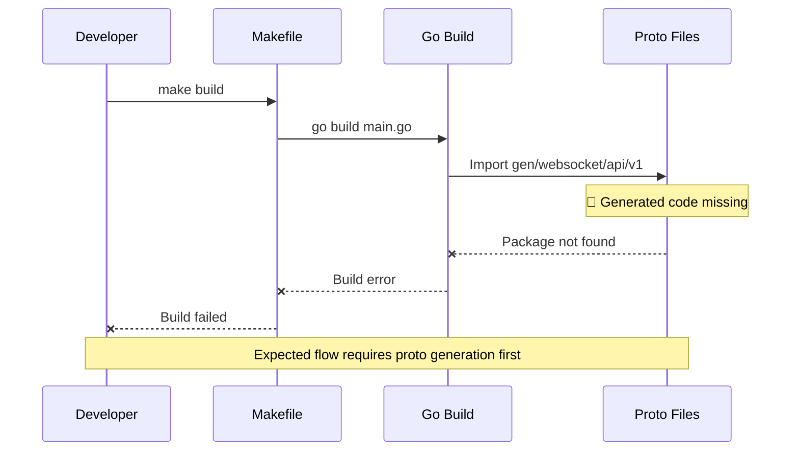

# Missing Proto Generation in Build Process - Critical

**Bug ID**: 01-bug-01  
**Discovery Phase**: Phase 1.1  
**Severity**: Critical  
**Status**: Fixed
**Reporter**: Bug Identification Process  
**Date Discovered**: 2024-06-24  

---

## What

### Problem Description
The build process fails because protobuf generated code is missing. The `main.go` file imports `github.com/Cryptovate-India/websocket-service/gen/websocket/api/v1` but this package doesn't exist until protobuf generation is run.

### Expected Behavior
The build process should either:
1. Automatically generate protobuf code before building, or
2. Include pre-generated protobuf code in the repository

### Actual Behavior  
Build fails with error:
```
main.go:14:2: no required module provides package github.com/Cryptovate-India/websocket-service/gen/websocket/api/v1; to add it:
        go get github.com/Cryptovate-India/websocket-service/gen/websocket/api/v1
make: *** [build] Error 1
```

### Impact Assessment
**Critical** - The service cannot be built or run without this fix. This blocks all development and deployment activities.

---

## Where

### Affected Files
| File Path | Line Numbers | Component |
|-----------|-------------|-----------|
| `main.go` | Line 14 | Main application import |
| `Makefile` | Lines 30-35 | Build process definition |

### Code Context
```go
// main.go line 14
import (
    // ... other imports ...
    websocketv1 "github.com/Cryptovate-India/websocket-service/gen/websocket/api/v1"
    // ... other imports ...
)
```

```makefile
# Makefile build target
build:
    $(GO) build $(LDFLAGS) -o $(SERVICE_NAME) main.go
```

### Related Configuration
- `protos/websocket/v1/api.proto` - Contains protobuf definitions
- `Makefile` proto target - Exists but not called during build

---

## Reproduction Steps

### Prerequisites
- Go 1.21+ installed
- Clean repository state

### Step-by-Step Instructions
1. Clone the repository
   ```bash
   git clone <repository>
   cd websocket-integration-challange
   ```

2. Attempt to build the service
   ```bash
   make build
   # Expected: Successful build
   # Actual: Build fails with import error
   ```

3. Verify the issue
   ```bash
   ls -la gen/
   # Expected: Generated protobuf files
   # Actual: Directory doesn't exist
   ```

### Reproduction Success Rate
**Always** - Build consistently fails on clean repository

### Environment Information
- **OS**: darwin 25.0.0 (macOS)
- **Go Version**: Latest
- **Dependencies**: Standard Go toolchain
- **Configuration**: Default Makefile configuration

---

## Flow Diagram



---

## Solution Space

### Approach 1: Modify Build Target to Include Proto Generation
**Description**: Update the Makefile build target to automatically run proto generation before building

**Pros**:
- Automatic proto generation on every build
- No manual steps required
- Consistent with "all" target pattern

**Cons**:
- Slightly slower builds (regenerates proto files every time)
- Requires protoc to be installed

**Implementation Effort**: Low

### Approach 2: Update Documentation and CI/CD
**Description**: Keep separate targets but update documentation to require proto generation first

**Pros**:
- Faster incremental builds
- Explicit control over when proto generation occurs
- Clear separation of concerns

**Cons**:
- Manual step required
- Easy to forget
- Inconsistent developer experience

**Implementation Effort**: Low

### Approach 3: Include Generated Code in Repository
**Description**: Commit the generated protobuf code to the repository

**Pros**:
- No build-time dependencies on protoc
- Faster builds
- Works on any system

**Cons**:
- Generated code in version control (anti-pattern)
- Potential sync issues between proto files and generated code
- Larger repository size

**Implementation Effort**: Low

---

## Recommended Fix

### Selected Approach
**Choice**: Approach 1 - Modify build target to include proto generation

**Rationale**: This provides the best developer experience while maintaining consistency with the existing "all" target that already includes proto generation.

### Implementation Pseudocode
```makefile
# Update the build target to depend on proto generation
build: proto
    $(GO) build $(LDFLAGS) -o $(SERVICE_NAME) main.go

# Alternative: Include proto generation directly in build
build:
    mkdir -p $(GEN_DIR)
    protoc --go_out=./gen ./protos/websocket/v1/api.proto --go-grpc_out=./gen
    $(GO) build $(LDFLAGS) -o $(SERVICE_NAME) main.go
```

### Specific Changes Required
1. **File**: `Makefile`
   - **Line 30**: Add `proto` dependency to build target: `build: proto`
   - **Alternative**: Include proto commands directly in build target

### Dependencies
- protoc (Protocol Buffer compiler) must be installed
- Go protobuf plugins must be available

---

## Verification Steps

### Test Case 1: Clean Build
```bash
# Start with clean state
rm -rf gen/
make clean

# Test the fix
make build
# Expected: Successful build with generated code

# Verify generated files exist
ls -la gen/websocket/api/v1/
# Expected: .pb.go files present
```

### Test Case 2: Incremental Build
```bash
# Build once
make build

# Build again without changes
make build
# Expected: Fast incremental build (or acceptable regeneration time)
```

### Test Case 3: Proto File Changes
```bash
# Modify proto file
echo "// comment" >> protos/websocket/v1/api.proto

# Build
make build
# Expected: New generated code reflects changes
```

---

## Additional Notes

### Root Cause Analysis
This bug exists because the build process was designed with separate concerns (proto generation vs compilation) but the dependency relationship wasn't enforced in the primary build target.

### Prevention Measures
- **Makefile validation**: Test all build targets in CI/CD
- **Documentation**: Clear build instructions
- **Developer setup**: Include proto generation in onboarding docs

### Related Issues
- **protoc dependency**: Requires protoc to be installed (separate issue)
- **CI/CD setup**: May need to install protoc in build pipelines

---

## Changelog

| Date | Action | Notes |
|------|--------|-------|
| 2024-06-24 | Created | Initial bug report during Phase 1 analysis |

---

## Attachments

- `build-verification.log` - Build output showing the import error
- `Makefile` - Current build configuration
- `protos/websocket/v1/api.proto` - Proto definition file 