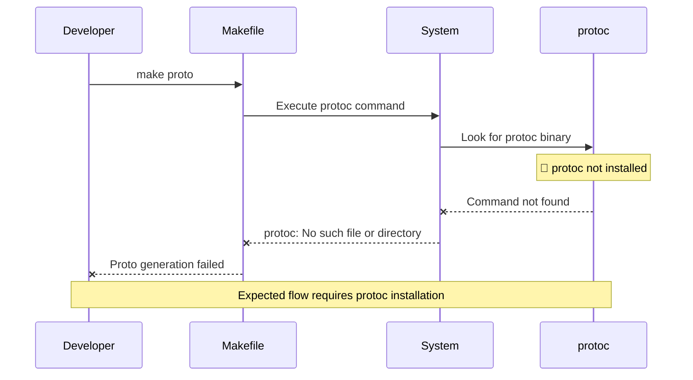

# Missing Protocol Buffer Compiler Dependency - High

**Bug ID**: 02-bug-02  
**Discovery Phase**: Phase 1.2  
**Severity**: High  
**Status**: Open  
**Reporter**: Bug Identification Process  
**Date Discovered**: 2024-06-24  

---

## What

### Problem Description
The build process requires the Protocol Buffer compiler (`protoc`) but it's not installed by default. This causes proto generation to fail, blocking the build process.

### Expected Behavior
The build system should either:
1. Include protoc installation in setup documentation, or
2. Check for protoc availability and provide clear error messages, or
3. Include protoc in automated setup scripts

### Actual Behavior  
Proto generation fails with error:
```
make: protoc: No such file or directory
make: *** [proto] Error 1
```

### Impact Assessment
**High** - Blocks development setup for new developers. Without protoc, the proto generation step fails and the service cannot be built.

---

## Where

### Affected Files
| File Path | Line Numbers | Component |
|-----------|-------------|-----------|
| `Makefile` | Line 42 | Proto generation target |
| `README.md` | Missing | Setup documentation |

### Code Context
```makefile
# Makefile proto target
proto:
    mkdir -p $(GEN_DIR)
    protoc --go_out=./gen ./protos/websocket/v1/api.proto  --go-grpc_out=./gen
```

### Related Configuration
- No dependency check in Makefile
- No installation instructions in documentation
- No alternative build paths for missing protoc

---

## Reproduction Steps

### Prerequisites
- Clean development environment without protoc installed
- Go 1.21+ installed

### Step-by-Step Instructions
1. Ensure protoc is not installed
   ```bash
   which protoc
   # Expected: Empty output or "not found"
   ```

2. Attempt proto generation
   ```bash
   make proto
   # Expected: Successful proto generation
   # Actual: "protoc: No such file or directory"
   ```

3. Verify the dependency issue
   ```bash
   protoc --version
   # Expected: Version output
   # Actual: "command not found"
   ```

### Reproduction Success Rate
**Always** - Consistently fails on systems without protoc

### Environment Information
- **OS**: darwin 25.0.0 (macOS)
- **Go Version**: Latest
- **Missing Dependency**: protoc (Protocol Buffer compiler)
- **Configuration**: Default Makefile setup

---

## Flow Diagram



---

## Solution Space

### Approach 1: Update Documentation with Installation Instructions
**Description**: Add clear protoc installation instructions to README and setup documentation

**Pros**:
- Simple and straightforward
- Developers know exactly what to install
- No build system changes required

**Cons**:
- Manual installation step
- Platform-specific instructions needed
- Easy to miss during setup

**Implementation Effort**: Low

### Approach 2: Add Dependency Check to Makefile
**Description**: Check for protoc availability and provide helpful error message

**Pros**:
- Clear error message when dependency missing
- Fails fast with actionable feedback
- No changes to proto generation logic

**Cons**:
- Still requires manual installation
- Additional Makefile complexity
- Doesn't solve the core dependency issue

**Implementation Effort**: Low

### Approach 3: Automated Installation Script
**Description**: Create setup script that installs protoc automatically

**Pros**:
- Fully automated setup
- Consistent installation across platforms
- Better developer experience

**Cons**:
- Platform-specific logic required
- May require admin permissions
- More complex to maintain

**Implementation Effort**: Medium

---

## Recommended Fix

### Selected Approach
**Choice**: Approach 1 + Approach 2 - Documentation + Makefile Check

**Rationale**: Provides immediate actionable feedback while maintaining simplicity and letting developers control their environment setup.

### Implementation Pseudocode
```makefile
# Add dependency check to proto target
proto:
    @which protoc > /dev/null || (echo "Error: protoc not found. Install with: brew install protobuf" && exit 1)
    mkdir -p $(GEN_DIR)
    protoc --go_out=./gen ./protos/websocket/v1/api.proto --go-grpc_out=./gen
```

```markdown
# Add to README.md
## Prerequisites

### Required Tools
- Go 1.21+
- Protocol Buffer Compiler (protoc)

### Installation

#### macOS
```bash
brew install protobuf
```

#### Ubuntu/Debian
```bash
sudo apt-get install protobuf-compiler
```

#### From Source
See [Protocol Buffers Installation Guide](https://grpc.io/docs/protoc-installation/)
```

### Specific Changes Required
1. **File**: `Makefile`
   - **Line 42**: Add protoc check before proto generation
   - **Error message**: Include installation instructions for common platforms

2. **File**: `README.md`
   - **Add**: Prerequisites section with protoc installation instructions
   - **Add**: Platform-specific installation commands

### Dependencies
- Documentation updates
- Platform-specific installation commands

---

## Verification Steps

### Test Case 1: Missing protoc Detection
```bash
# Temporarily remove protoc from PATH
export PATH=$(echo $PATH | sed 's|/opt/homebrew/bin||g')

# Test the check
make proto
# Expected: Clear error message with installation instructions
```

### Test Case 2: Successful Installation Flow
```bash
# Follow documentation instructions
brew install protobuf

# Test proto generation
make proto
# Expected: Successful generation
```

### Test Case 3: Cross-Platform Instructions
```bash
# Test instructions work on different platforms
# (Manual verification across macOS, Linux, Windows)
```

---

## Additional Notes

### Root Cause Analysis
This dependency issue exists because protoc is an external tool not managed by Go modules. The build process assumes it's available without checking or providing guidance.

### Prevention Measures
- **Dependency documentation**: Clear prerequisites in README
- **Setup scripts**: Consider automated environment setup
- **CI/CD validation**: Ensure build environments have all dependencies
- **Docker alternative**: Provide containerized build environment

### Related Issues
- **Go protobuf plugins**: Also need to be installed (separate but related)
- **CI/CD setup**: Need to install protoc in build pipelines
- **Developer onboarding**: Add to setup checklist

### References
- [Protocol Buffers Installation Guide](https://grpc.io/docs/protoc-installation/)
- [Go Protocol Buffers](https://developers.google.com/protocol-buffers/docs/gotutorial)

---

## Changelog

| Date | Action | Notes |
|------|--------|-------|
| 2024-06-24 | Created | Initial bug report during Phase 1.2 analysis |

---

## Attachments

- Build error log showing "protoc: No such file or directory"
- System output showing protoc not in PATH 