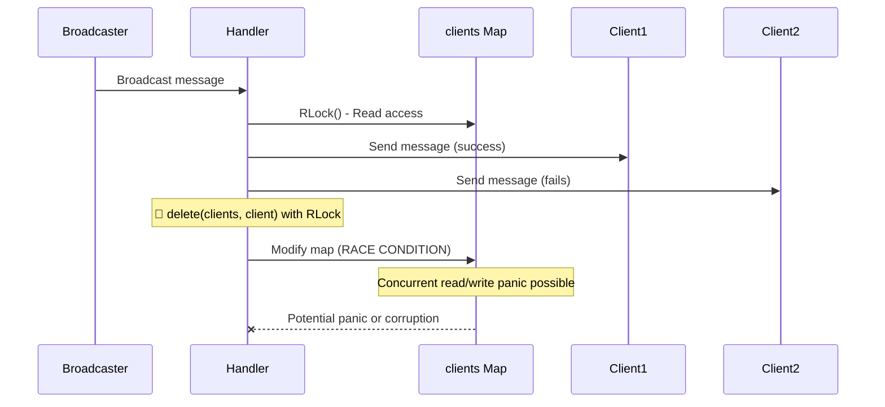

# Race Condition in WebSocket Handler Broadcast - High

**Bug ID**: 03-bug-03  
**Discovery Phase**: Phase 2.2  
**Severity**: High  
**Status**: Open  
**Reporter**: Bug Identification Process  
**Date Discovered**: 2024-06-24  

---

## What

### Problem Description
The WebSocket handler has a race condition in the `run()` method where the `clients` map is modified without proper mutex locking in the broadcast case. This can cause concurrent map access panics under load.

### Expected Behavior
All access to shared data structures (like the `clients` map) should be properly synchronized with mutexes to prevent race conditions and panics.

### Actual Behavior  
In the broadcast case of the `run()` method, the code modifies the `clients` map without acquiring the `clientsMu` lock:
```go
case message := <-h.broadcast:
    h.clientsMu.RLock()  // Read lock acquired
    for client := range h.clients {
        select {
        case client.send <- message:
        default:
            close(client.send)
            delete(h.clients, client)  // 🐛 Map modification with read lock!
        }
    }
    h.clientsMu.RUnlock()
```

### Impact Assessment
**High** - Can cause runtime panics with "concurrent map read and map write" errors, especially under high load with many concurrent connections.

---

## Where

### Affected Files
| File Path | Line Numbers | Component |
|-----------|-------------|-----------|
| `internal/handlers/websocket_handler.go` | Lines 278-289 | WebSocket handler run method |

### Code Context
```go
// Line ~278 in run() method
case message := <-h.broadcast:
    // Broadcast the message to all clients
    h.clientsMu.RLock()  // ← Read lock only
    for client := range h.clients {
        select {
        case client.send <- message:
        default:
            close(client.send)
            delete(h.clients, client)  // ← BUG: Writing to map with read lock
        }
    }
    h.clientsMu.RUnlock()
```

### Related Configuration
- `clientsMu sync.RWMutex` - Protects the clients map
- Proper locking used in register/unregister cases
- Race condition only in broadcast case

---

## Reproduction Steps

### Prerequisites
- Service running with multiple concurrent WebSocket connections
- High message broadcast frequency
- Go race detector enabled

### Step-by-Step Instructions
1. Build with race detector
   ```bash
   go build -race -o websocket-service-race .
   ```

2. Start the service
   ```bash
   ./websocket-service-race &
   ```

3. Create multiple concurrent connections
   ```bash
   # Terminal 1-5: Create multiple WebSocket connections
   wscat -c ws://localhost:8083/ws &
   wscat -c ws://localhost:8083/ws &
   wscat -c ws://localhost:8083/ws &
   wscat -c ws://localhost:8083/ws &
   wscat -c ws://localhost:8083/ws &
   ```

4. Generate high broadcast traffic
   ```bash
   # Send messages that will trigger broadcasts
   # Some connections will fail and trigger the race condition
   ```

5. Observe race condition
   ```bash
   # Expected: Clean operation
   # Actual: Race detector warnings or panic
   ```

### Reproduction Success Rate
**Sometimes (30-70%)** - Depends on timing and load, more likely under high concurrency

### Environment Information
- **OS**: darwin 25.0.0 (macOS)
- **Go Version**: Latest with race detector
- **Load Conditions**: Multiple concurrent connections with broadcast traffic
- **Configuration**: Default service configuration

---

## Flow Diagram



---

## Solution Space

### Approach 1: Collect Failed Clients, Then Remove
**Description**: Collect failed clients during read lock, then acquire write lock to remove them

**Pros**:
- Minimal lock contention
- Preserves existing logic flow
- Safe concurrent access

**Cons**:
- Slightly more complex code
- Additional memory for failed clients list
- Two-phase operation

**Implementation Effort**: Low

### Approach 2: Use Write Lock for Entire Broadcast
**Description**: Acquire write lock for the entire broadcast operation

**Pros**:
- Simple fix
- Guarantees exclusive access
- Easy to understand

**Cons**:
- Reduced concurrency (blocks register/unregister)
- Potential performance impact
- Longer lock duration

**Implementation Effort**: Low

### Approach 3: Separate Channel for Client Removal
**Description**: Send failed clients to unregister channel instead of direct removal

**Pros**:
- Consistent with existing unregister pattern
- No additional locking needed
- Better separation of concerns

**Cons**:
- Indirect removal (less immediate)
- More complex message flow
- Potential for duplicate removal attempts

**Implementation Effort**: Medium

---

## Recommended Fix

### Selected Approach
**Choice**: Approach 1 - Collect Failed Clients, Then Remove

**Rationale**: Provides the best balance of safety, performance, and code clarity while maintaining the existing pattern of immediate cleanup.

### Implementation Pseudocode
```go
case message := <-h.broadcast:
    // First pass: send messages and collect failed clients
    var failedClients []*Client
    h.clientsMu.RLock()
    for client := range h.clients {
        select {
        case client.send <- message:
            // Success, continue
        default:
            // Failed to send, collect for removal
            close(client.send)
            failedClients = append(failedClients, client)
        }
    }
    h.clientsMu.RUnlock()
    
    // Second pass: remove failed clients with write lock
    if len(failedClients) > 0 {
        h.clientsMu.Lock()
        for _, client := range failedClients {
            delete(h.clients, client)
        }
        h.clientsMu.Unlock()
    }
```

### Specific Changes Required
1. **File**: `internal/handlers/websocket_handler.go`
   - **Lines 278-289**: Replace direct map modification with two-phase approach
   - **Add**: Failed clients collection slice
   - **Add**: Separate write lock for cleanup

### Dependencies
- No new dependencies required
- Maintains existing locking patterns

---

## Verification Steps

### Test Case 1: Race Detector Validation
```bash
# Build with race detector
go build -race -o websocket-service-race .

# Run with high concurrency
./websocket-service-race &

# Create load test that triggers broadcast failures
# Should show no race condition warnings
```

### Test Case 2: Concurrent Broadcast Load Test
```bash
# Create multiple connections
for i in {1..10}; do wscat -c ws://localhost:8083/ws & done

# Generate broadcast traffic
# Monitor for panics or errors
```

### Test Case 3: Functional Verification
```bash
# Ensure client removal still works correctly
# Verify failed clients are properly cleaned up
# Check memory usage doesn't grow
```

### Automated Tests
```go
func TestConcurrentBroadcastClientRemoval(t *testing.T) {
    // Create handler with multiple clients
    // Some with blocked send channels
    // Trigger broadcast operation
    // Verify no race conditions and proper cleanup
}
```

---

## Additional Notes

### Root Cause Analysis
This race condition exists because the broadcast logic tries to clean up failed clients immediately during message sending, but uses a read lock that doesn't allow map modifications. The pattern works for simple read operations but breaks when cleanup is needed.

### Prevention Measures
- **Code review focus**: Always check map access patterns with mutexes
- **Race detector**: Run tests with `-race` flag regularly
- **Load testing**: Include concurrent connection scenarios
- **Linting rules**: Add checks for common race condition patterns

### Related Issues
- Similar pattern might exist in other concurrent map operations
- Consider overall concurrency design for high-load scenarios
- Monitor for other goroutine safety issues

### References
- [Go Memory Model](https://golang.org/ref/mem)
- [Race Detector Documentation](https://golang.org/doc/articles/race_detector.html)
- [Effective Go - Concurrency](https://golang.org/doc/effective_go.html#concurrency)

---

## Changelog

| Date | Action | Notes |
|------|--------|-------|
| 2024-06-24 | Created | Initial bug report during Phase 2.2 analysis |

---

## Attachments

- Code section showing race condition
- Race detector output (when available)
- Concurrency analysis notes 