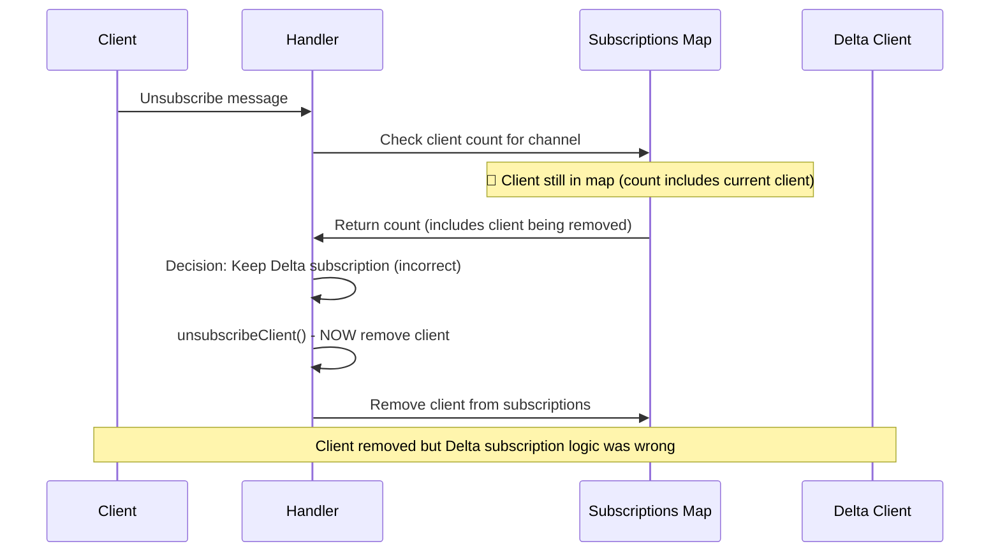

# Logic Error in Unsubscribe Client Count Check - Medium

**Bug ID**: 04-bug-04  
**Discovery Phase**: Phase 2.2  
**Severity**: Medium  
**Status**: Fixed
**Reporter**: Bug Identification Process  
**Date Discovered**: 2024-06-24  

---

## What

### Problem Description
The `handleUnsubscribe` method has a logic error where it checks the client count for a channel before removing the current client from subscriptions. This causes incorrect behavior when determining if the channel should be unsubscribed from the Delta Exchange.

### Expected Behavior
The logic should:
1. Remove the client from the channel subscription
2. Check if any clients remain subscribed to the channel  
3. If no clients remain, unsubscribe from Delta Exchange

### Actual Behavior  
The current logic checks the client count before removing the client:
```go
if clients, ok := h.subscriptions[channelName]; ok {
    if len(clients) == 0 {  // ← BUG: Check before removal
        h.deltaClient.Unsubscribe(channelName)
    } else {
        fmt.Println("WS_handler: Delta: still ", len(clients), " clients subscribed to channel: ", channelName)
    }
} else {
    h.deltaClient.Unsubscribe(channelName)
}
// Client removal happens AFTER the check
h.unsubscribeClient(client, channelName)
```

### Impact Assessment
**Medium** - Causes incorrect Delta Exchange unsubscription behavior. Channels may not be unsubscribed when they should be, or may be unsubscribed prematurely.

---

## Where

### Affected Files
| File Path | Line Numbers | Component |
|-----------|-------------|-----------|
| `internal/handlers/websocket_handler.go` | Lines 520-535 | handleUnsubscribe method |

### Code Context
```go
// Lines ~520-535 in handleUnsubscribe method
if h.deltaClient != nil {
    if channel, ok := msg["type"].(string); ok {
        if channel == "unsubscribe" {
            fmt.Println("WS_handler: Delta: unsubscribing from channel: ", channelName)
            //check if no other subscriptions exist for this channel
            if clients, ok := h.subscriptions[channelName]; ok {
                if len(clients) == 0 {  // ← BUG: Always false because client not removed yet
                    h.deltaClient.Unsubscribe(channelName)
                } else {
                    fmt.Println("WS_handler: Delta: still ", len(clients), " clients subscribed to channel: ", channelName)
                }
            } else {
                h.deltaClient.Unsubscribe(channelName)
                fmt.Println("WS_handler: Delta: unsubscribed from channel: ", channelName)
            }
        }
    }
}
// Client removal happens here, AFTER the check above
h.unsubscribeClient(client, channelName)
```

### Related Configuration
- `h.subscriptions` map tracks client subscriptions per channel
- `h.deltaClient.Unsubscribe()` removes channel from Delta Exchange
- `h.unsubscribeClient()` removes client from internal tracking

---

## Reproduction Steps

### Prerequisites
- Service running with Delta Exchange integration enabled
- Multiple WebSocket clients connected
- Clients subscribed to the same channel

### Step-by-Step Instructions
1. Start the service
   ```bash
   ./websocket-service &
   ```

2. Connect multiple clients to same channel
   ```bash
   # Client 1
   wscat -c ws://localhost:8083/ws
   # Send: {"type":"subscribe","payload":{"channels":[{"name":"v2/ticker","symbols":["all"]}]}}
   
   # Client 2
   wscat -c ws://localhost:8083/ws  
   # Send: {"type":"subscribe","payload":{"channels":[{"name":"v2/ticker","symbols":["all"]}]}}
   ```

3. Unsubscribe one client
   ```bash
   # From Client 1, send unsubscribe
   {"type":"unsubscribe","payload":{"channels":[{"name":"v2/ticker"}]}}
   # Expected: Client removed, Delta subscription maintained (other client still subscribed)
   # Actual: Logic check happens before client removal
   ```

4. Check server logs
   ```bash
   # Expected: "still X clients subscribed" message
   # Actual: May show incorrect client count or behavior
   ```

### Reproduction Success Rate
**Always** - Logic error occurs consistently due to order of operations

### Environment Information
- **OS**: darwin 25.0.0 (macOS)
- **Go Version**: Latest
- **Delta Integration**: Enabled
- **Configuration**: Default with Delta Exchange connection

---

## Flow Diagram



---

## Solution Space

### Approach 1: Move Client Removal Before Delta Check
**Description**: Call `unsubscribeClient()` before checking if Delta unsubscription is needed

**Pros**:
- Simple reordering of operations
- Correct logic flow
- Minimal code changes

**Cons**:
- Need to handle potential errors if unsubscribe fails
- Slight change in error handling flow

**Implementation Effort**: Low

### Approach 2: Check Count Minus Current Client
**Description**: Modify the count check to account for the current client being removed

**Pros**:
- Preserves current operation order
- Explicit about the logic
- No error handling changes needed

**Cons**:
- More complex logic
- Potential for off-by-one errors
- Less intuitive code flow

**Implementation Effort**: Low

### Approach 3: Separate Delta Logic into Helper Method
**Description**: Extract Delta unsubscription logic into a separate method that handles the correct sequencing

**Pros**:
- Better separation of concerns
- Reusable logic
- Clearer code structure

**Cons**:
- More code changes
- Additional method complexity
- Potential over-engineering

**Implementation Effort**: Medium

---

## Recommended Fix

### Selected Approach
**Choice**: Approach 1 - Move Client Removal Before Delta Check

**Rationale**: This provides the most straightforward fix with correct logic flow and minimal complexity. It matches the natural order of operations.

### Implementation Pseudocode
```go
func (h *WebsocketHandler) handleUnsubscribe(client *Client, msg map[string]interface{}) {
    // ... parse message to get channelName ...
    
    // FIRST: Remove client from subscriptions
    h.unsubscribeClient(client, channelName)
    
    // THEN: Check if Delta unsubscription is needed
    if h.deltaClient != nil {
        if channel, ok := msg["type"].(string); ok {
            if channel == "unsubscribe" {
                fmt.Println("WS_handler: Delta: unsubscribing from channel: ", channelName)
                
                // Now check if any OTHER clients are still subscribed
                h.subscriptionsMu.RLock()
                if clients, ok := h.subscriptions[channelName]; ok {
                    if len(clients) == 0 {
                        // No clients left, unsubscribe from Delta
                        h.deltaClient.Unsubscribe(channelName)
                    } else {
                        fmt.Println("WS_handler: Delta: still ", len(clients), " clients subscribed to channel: ", channelName)
                    }
                } else {
                    // Channel not found, unsubscribe from Delta
                    h.deltaClient.Unsubscribe(channelName)
                }
                h.subscriptionsMu.RUnlock()
            }
        }
    }
    
    // Send confirmation response...
}
```

### Specific Changes Required
1. **File**: `internal/handlers/websocket_handler.go`
   - **Lines 520-535**: Move `h.unsubscribeClient(client, channelName)` before Delta check
   - **Add**: Proper mutex locking around subscription count check
   - **Update**: Log messages to reflect correct client count

### Dependencies
- No new dependencies required
- Must ensure proper mutex usage for subscription map access

---

## Verification Steps

### Test Case 1: Single Client Unsubscribe
```bash
# Connect one client and subscribe
wscat -c ws://localhost:8083/ws
# Send subscribe message

# Unsubscribe the client
# Send unsubscribe message

# Verify Delta unsubscription occurs (check logs)
# Expected: Delta unsubscribe called
```

### Test Case 2: Multiple Clients Same Channel
```bash
# Connect two clients to same channel
# Client 1 subscribes
# Client 2 subscribes

# Client 1 unsubscribes
# Expected: Delta subscription maintained, correct client count logged

# Client 2 unsubscribes  
# Expected: Delta unsubscription occurs
```

### Test Case 3: Error Conditions
```bash
# Test unsubscribe with invalid channel
# Test unsubscribe when not subscribed
# Verify error handling works correctly
```

### Automated Tests
```go
func TestUnsubscribeClientCountLogic(t *testing.T) {
    // Create handler with multiple clients subscribed to same channel
    // Unsubscribe one client
    // Verify correct client count check
    // Verify appropriate Delta subscription actions
}
```

---

## Additional Notes

### Root Cause Analysis
This logic error exists because the unsubscribe operation was split into two phases (Delta management and internal cleanup) but the dependency between them wasn't properly considered. The Delta decision depends on the internal state after cleanup.

### Prevention Measures
- **Unit tests**: Cover subscription/unsubscription logic thoroughly
- **Integration tests**: Test multi-client scenarios
- **Code review**: Focus on order of operations in state changes
- **Documentation**: Clear comments about operation sequencing

### Related Issues
- Similar logic patterns may exist in other subscription management code
- Consider overall subscription state management design
- Potential for similar issues in error handling paths

### References
- WebSocket subscription management best practices
- State management patterns in concurrent systems

---

## Changelog

| Date | Action | Notes |
|------|--------|-------|
| 2024-06-24 | Created | Initial bug report during Phase 2.2 analysis |

---

## Attachments

- Code section showing incorrect logic flow
- Sequence diagram illustrating the problem
- Expected vs actual behavior examples 