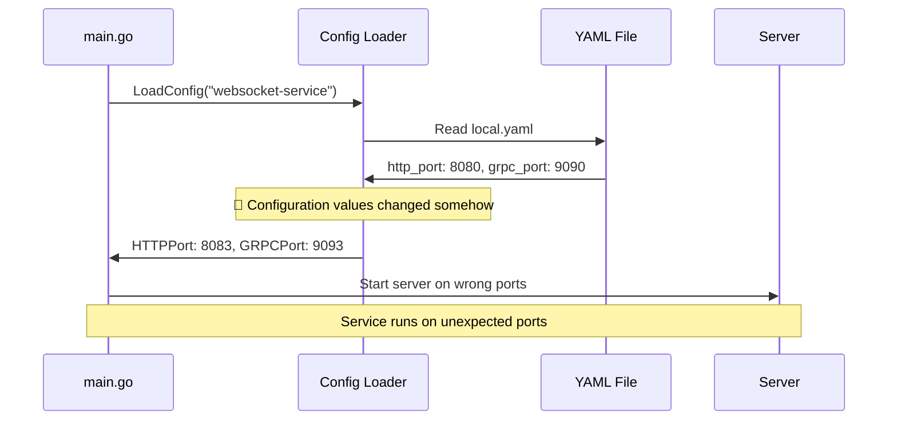

# Configuration Port Mismatch - Medium

**Bug ID**: 05-bug-05  
**Discovery Phase**: Phase 3.1  
**Severity**: Medium  
**Status**: Open  
**Reporter**: Bug Identification Process  
**Date Discovered**: 2024-06-24  

---

## What

### Problem Description
The service ignores the configured port settings in the YAML configuration files and uses different ports than expected. The local.yaml specifies ports 8080 (HTTP) and 9090 (gRPC) but the service actually runs on ports 8083 (HTTP) and 9093 (gRPC).

### Expected Behavior
The service should use the ports specified in the configuration file:
- HTTP server: Port 8080 (as configured in local.yaml)
- gRPC server: Port 9090 (as configured in local.yaml)

### Actual Behavior  
The service starts with different ports:
```
2025/06/24 21:55:54 Starting HTTP server on port 8083
2025/06/24 21:55:54 Starting gRPC server on port 9093
```

But the configuration file shows:
```yaml
http_port: 8080
grpc_port: 9090
```

### Impact Assessment
**Medium** - Service is not accessible on documented/expected ports, breaking client connections and documentation. Causes confusion and deployment issues.

---

## Where

### Affected Files
| File Path | Line Numbers | Component |
|-----------|-------------|-----------|
| `config/local.yaml` | Lines 7-8 | Port configuration |
| `internal/config/config.go` | Unknown | Configuration loading |
| `main.go` | Lines 60-64, 88-93 | Server initialization |

### Code Context
```yaml
# config/local.yaml
http_port: 8080
grpc_port: 9090
```

```go
// main.go - HTTP server startup
httpServer := &http.Server{
    Addr:    fmt.Sprintf(":%d", cfg.HTTPPort),  // Should use 8080
    Handler: mux,
}
```

### Related Configuration
- Configuration loading mechanism in `internal/config/config.go`
- Environment variable overrides
- Default value handling

---

## Reproduction Steps

### Prerequisites
- Service built and ready to run
- Configuration files in place

### Step-by-Step Instructions
1. Check configuration file
   ```bash
   cat config/local.yaml | grep -E "http_port|grpc_port"
   # Expected: http_port: 8080, grpc_port: 9090
   ```

2. Start the service
   ```bash
   ./websocket-service
   # Expected: Starting servers on ports 8080 and 9090
   # Actual: Starting servers on ports 8083 and 9093
   ```

3. Verify actual ports
   ```bash
   curl -s http://localhost:8080/health
   # Expected: "OK"
   # Actual: Connection refused
   
   curl -s http://localhost:8083/health  
   # Expected: Connection refused
   # Actual: "OK"
   ```

4. Check port binding
   ```bash
   netstat -an | grep LISTEN | grep -E "8080|8083|9090|9093"
   # Shows which ports are actually bound
   ```

### Reproduction Success Rate
**Always** - Configuration mismatch occurs consistently

### Environment Information
- **OS**: darwin 25.0.0 (macOS)
- **Go Version**: Latest
- **Configuration**: Using local.yaml environment
- **Config Loading**: Default configuration loading mechanism

---

## Flow Diagram



---

## Solution Space

### Approach 1: Debug Configuration Loading Logic
**Description**: Investigate and fix the configuration loading mechanism to ensure proper value assignment

**Pros**:
- Addresses root cause
- Ensures all config values work correctly
- Proper configuration management

**Cons**:
- May require significant debugging
- Could uncover additional configuration issues
- Unknown scope of changes needed

**Implementation Effort**: Medium

### Approach 2: Add Configuration Validation and Logging
**Description**: Add logging to show which configuration values are loaded and validate they match expectations

**Pros**:
- Helps identify where configuration goes wrong
- Provides debugging information
- Non-intrusive changes

**Cons**:
- Doesn't fix the underlying issue
- May just highlight the problem
- Additional logging overhead

**Implementation Effort**: Low

### Approach 3: Environment Variable Override Check
**Description**: Check if environment variables are overriding the YAML configuration values

**Pros**:
- Common cause of configuration mismatches
- Easy to verify and fix
- Maintains intended behavior

**Cons**:
- May not be the actual cause
- Could be a red herring
- Limited scope solution

**Implementation Effort**: Low

---

## Recommended Fix

### Selected Approach
**Choice**: Approach 2 + Approach 3 - Debug with logging and check environment overrides

**Rationale**: Start with low-risk investigation to understand the root cause, then apply the appropriate fix based on findings.

### Implementation Pseudocode
```go
// Add to configuration loading
func LoadConfig(serviceName string) (*Config, error) {
    cfg := &Config{}
    
    // Load YAML configuration
    err := loadYAMLConfig(cfg, serviceName)
    if err != nil {
        return nil, err
    }
    
    // Log loaded values for debugging
    log.Printf("Loaded config - HTTP Port: %d, gRPC Port: %d", cfg.HTTPPort, cfg.GRPCPort)
    
    // Check for environment variable overrides
    if envHTTPPort := os.Getenv("HTTP_PORT"); envHTTPPort != "" {
        log.Printf("HTTP_PORT environment override: %s", envHTTPPort)
        // Parse and apply override
    }
    
    if envGRPCPort := os.Getenv("GRPC_PORT"); envGRPCPort != "" {
        log.Printf("GRPC_PORT environment override: %s", envGRPCPort)
        // Parse and apply override
    }
    
    // Validate final configuration
    log.Printf("Final config - HTTP Port: %d, gRPC Port: %d", cfg.HTTPPort, cfg.GRPCPort)
    
    return cfg, nil
}
```

### Specific Changes Required
1. **File**: `internal/config/config.go`
   - **Add**: Configuration loading debug logging
   - **Add**: Environment variable override checking
   - **Add**: Final configuration validation

2. **Investigation**: 
   - Check if environment variables are set
   - Verify YAML parsing logic
   - Confirm struct field mappings

### Dependencies
- May need to review YAML parsing library usage
- Check environment variable handling

---

## Verification Steps

### Test Case 1: Configuration File Values
```bash
# Verify configuration file content
cat config/local.yaml | grep -E "http_port|grpc_port"

# Start service with debug logging
./websocket-service 2>&1 | grep -E "port|Port"
# Expected: Shows configuration loading process
```

### Test Case 2: Environment Variable Check
```bash
# Check for environment overrides
env | grep -E "HTTP_PORT|GRPC_PORT|PORT"

# Clear any environment variables
unset HTTP_PORT GRPC_PORT

# Test service startup
./websocket-service
# Expected: Should use config file values
```

### Test Case 3: Configuration Validation
```bash
# Modify config file to test loading
sed -i.bak 's/http_port: 8080/http_port: 8888/' config/local.yaml

# Start service
./websocket-service
# Expected: Should start on port 8888

# Restore original
mv config/local.yaml.bak config/local.yaml
```

---

## Additional Notes

### Root Cause Analysis
This configuration mismatch could be caused by:
1. Environment variable overrides
2. Incorrect YAML field mapping in Go structs
3. Default values being applied instead of configured values
4. Configuration file not being loaded from expected location
5. Multiple configuration files with precedence issues

### Prevention Measures
- **Configuration validation**: Add startup validation that prints loaded config
- **Unit tests**: Test configuration loading with various scenarios
- **Documentation**: Clear precedence rules for configuration sources
- **Logging**: Always log which configuration file and values are being used

### Related Issues
- May affect other configuration values beyond ports
- Could impact deployment and containerization
- Documentation may need updates to reflect actual behavior

### References
- Go configuration management best practices
- YAML parsing in Go applications
- Environment variable precedence patterns

---

## Changelog

| Date | Action | Notes |
|------|--------|-------|
| 2024-06-24 | Created | Initial bug report during Phase 3.1 analysis |

---

## Attachments

- Service startup logs showing incorrect ports
- Configuration file content showing expected ports
- Environment variable dump
- Port binding verification commands 