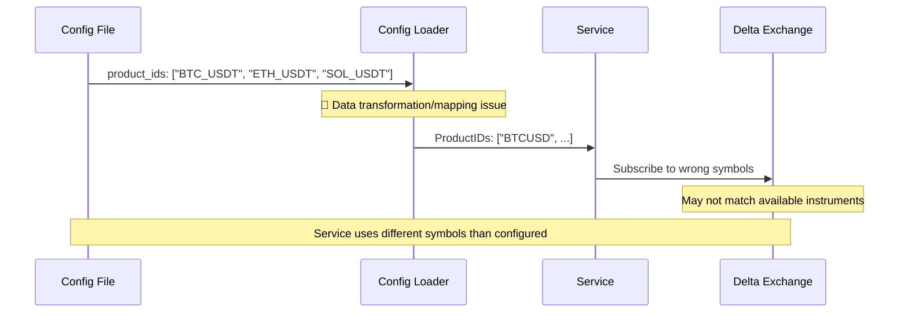

# Configuration Data Mismatch in Product IDs - Medium

**Bug ID**: 06-bug-06  
**Discovery Phase**: Phase 3.1  
**Severity**: Medium  
**Status**: Open  
**Reporter**: Bug Identification Process  
**Date Discovered**: 2024-06-24  

---

## What

### Problem Description
The service configuration loading has data mismatches where the configured product IDs in the YAML file don't match what the service actually uses. The config file specifies `BTC_USDT` but the service logs show `BTCUSD`.

### Expected Behavior
The service should use exactly the product IDs specified in the configuration file:
- Configuration: `BTC_USDT`, `ETH_USDT`, `SOL_USDT`
- Service behavior: Subscribe to those exact symbols

### Actual Behavior  
The service shows different product IDs in logs:
```
Websocket handler config: ... {true wss://socket.india.delta.exchange [v2/ticker] [BTCUSD] 5}
```

But the configuration file shows:
```yaml
delta:
  product_ids:
    - "BTC_USDT"
    - "ETH_USDT"  
    - "SOL_USDT"
```

### Impact Assessment
**Medium** - Service subscribes to wrong trading pairs, potentially missing market data or receiving data for unintended instruments. Could impact trading decisions and data accuracy.

---

## Where

### Affected Files
| File Path | Line Numbers | Component |
|-----------|-------------|-----------|
| `config/local.yaml` | Lines 35-39 | Delta product configuration |
| `internal/config/config.go` | Unknown | Configuration loading logic |
| Output logs | Service startup | Configuration display |

### Code Context
```yaml
# config/local.yaml
delta:
  enabled: true
  url: "wss://socket.india.delta.exchange"
  channels:
    - "v2/ticker"
    - "v2/trades"
  product_ids:
    - "BTC_USDT"  # ← Configured value
    - "ETH_USDT"
    - "SOL_USDT"
```

```
# Service log output
Websocket handler config: ... [BTCUSD] 5}
                              ↑
                              Actual value used
```

### Related Configuration
- YAML parsing for product_ids array
- String array handling in Go structs
- Configuration struct field mapping

---

## Reproduction Steps

### Prerequisites
- Service built and configured with local.yaml
- Delta Exchange integration enabled

### Step-by-Step Instructions
1. Check configuration file content
   ```bash
   cat config/local.yaml | grep -A 10 "product_ids"
   # Expected: Shows BTC_USDT, ETH_USDT, SOL_USDT
   ```

2. Start the service and capture configuration output
   ```bash
   ./websocket-service 2>&1 | grep -A 5 -B 5 "Websocket handler config"
   # Expected: Should show configured product IDs
   # Actual: Shows different product IDs (BTCUSD instead of BTC_USDT)
   ```

3. Compare configured vs actual values
   ```bash
   # Compare what's in config vs what's logged
   diff <(grep -A 5 "product_ids" config/local.yaml) <(echo "Service logs show: BTCUSD")
   ```

### Reproduction Success Rate
**Always** - Configuration mismatch occurs consistently

### Environment Information
- **OS**: darwin 25.0.0 (macOS)
- **Go Version**: Latest
- **Configuration**: Using local.yaml with Delta Exchange settings
- **Delta Integration**: Enabled

---

## Flow Diagram



---

## Solution Space

### Approach 1: Debug Configuration Parsing Logic
**Description**: Investigate the YAML parsing and struct mapping to identify where the transformation occurs

**Pros**:
- Identifies root cause of data mismatch
- Ensures all configuration arrays work correctly
- Comprehensive fix

**Cons**:
- May require significant debugging time
- Could uncover broader configuration issues
- Unknown complexity

**Implementation Effort**: Medium

### Approach 2: Add Configuration Validation and Comparison
**Description**: Add logging to show exactly what values are parsed vs what's in the file

**Pros**:
- Quick identification of the transformation point
- Non-intrusive debugging approach
- Helps verify fix effectiveness

**Cons**:
- Doesn't solve the underlying issue
- Additional logging overhead
- May reveal multiple issues

**Implementation Effort**: Low

### Approach 3: Default Value Override Investigation
**Description**: Check if default values are overriding the configured values

**Pros**:
- Common cause of configuration mismatches
- Easy to verify and fix
- Minimal code changes if this is the cause

**Cons**:
- May not be the actual root cause
- Limited scope solution
- Doesn't address broader parsing issues

**Implementation Effort**: Low

---

## Recommended Fix

### Selected Approach
**Choice**: Approach 2 + Approach 1 - Debug first, then fix parsing

**Rationale**: Start with logging to understand exactly what's happening, then fix the underlying configuration parsing issue.

### Implementation Pseudocode
```go
// Add to configuration loading
func loadDeltaConfig(cfg *DeltaConfig, yamlData map[string]interface{}) error {
    // Log raw YAML data
    log.Printf("Raw YAML product_ids: %v", yamlData["product_ids"])
    
    // Parse product IDs
    if productIds, ok := yamlData["product_ids"].([]interface{}); ok {
        log.Printf("Parsed product_ids count: %d", len(productIds))
        
        cfg.ProductIDs = make([]string, len(productIds))
        for i, id := range productIds {
            if strID, ok := id.(string); ok {
                cfg.ProductIDs[i] = strID
                log.Printf("Product ID [%d]: '%s'", i, strID)
            } else {
                log.Printf("Product ID [%d]: type conversion failed, got %T", i, id)
            }
        }
    } else {
        log.Printf("Failed to parse product_ids as array, got type: %T", yamlData["product_ids"])
    }
    
    // Log final configuration
    log.Printf("Final ProductIDs: %v", cfg.ProductIDs)
    
    return nil
}
```

### Specific Changes Required
1. **File**: `internal/config/config.go`
   - **Add**: Detailed logging of YAML parsing process
   - **Add**: Type checking and conversion validation
   - **Fix**: Correct parsing logic if issues found

2. **Investigation Steps**:
   - Verify YAML structure matches Go struct tags
   - Check for type conversion issues
   - Confirm no default values are overriding parsed values

### Dependencies
- May need to review YAML parsing library
- Check struct field tags and types

---

## Verification Steps

### Test Case 1: Configuration Parsing Verification
```bash
# Add debug output to config loading
./websocket-service 2>&1 | grep -E "product|Product|ID"
# Expected: Shows step-by-step parsing of product IDs
```

### Test Case 2: YAML Structure Validation
```bash
# Validate YAML syntax and structure
python3 -c "
import yaml
with open('config/local.yaml') as f:
    data = yaml.safe_load(f)
    print('Product IDs:', data['delta']['product_ids'])
"
# Expected: Correct product ID values
```

### Test Case 3: Configuration Modification Test
```bash
# Modify config to test if changes are reflected
sed -i.bak 's/BTC_USDT/TEST_SYMBOL/' config/local.yaml

# Start service and check if TEST_SYMBOL appears
./websocket-service 2>&1 | grep TEST_SYMBOL
# Expected: Should show TEST_SYMBOL in logs

# Restore original
mv config/local.yaml.bak config/local.yaml
```

---

## Additional Notes

### Root Cause Analysis
This configuration data mismatch could be caused by:
1. Incorrect YAML struct field mapping in Go
2. Default values overriding parsed values
3. Type conversion issues during parsing
4. String transformation or normalization
5. Multiple configuration sources with precedence conflicts

### Prevention Measures
- **Configuration unit tests**: Test parsing of all data types
- **Validation logging**: Always log critical configuration values at startup
- **Schema validation**: Use configuration schema validation
- **Type safety**: Ensure proper type handling in config parsing

### Related Issues
- Other configuration arrays may have similar issues
- String values throughout configuration may be affected
- Could impact Delta Exchange integration functionality

### References
- Go YAML parsing best practices
- Configuration validation patterns
- Struct tag usage in Go

---

## Changelog

| Date | Action | Notes |
|------|--------|-------|
| 2024-06-24 | Created | Initial bug report during Phase 3.1 analysis |

---

## Attachments

- Configuration file showing expected values
- Service logs showing actual values used
- YAML structure validation output 